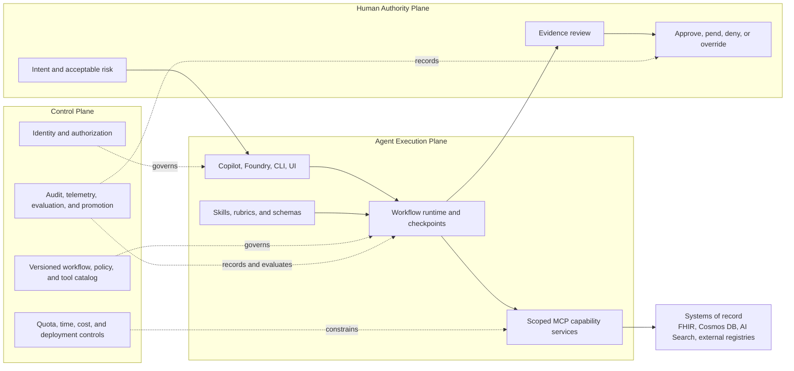
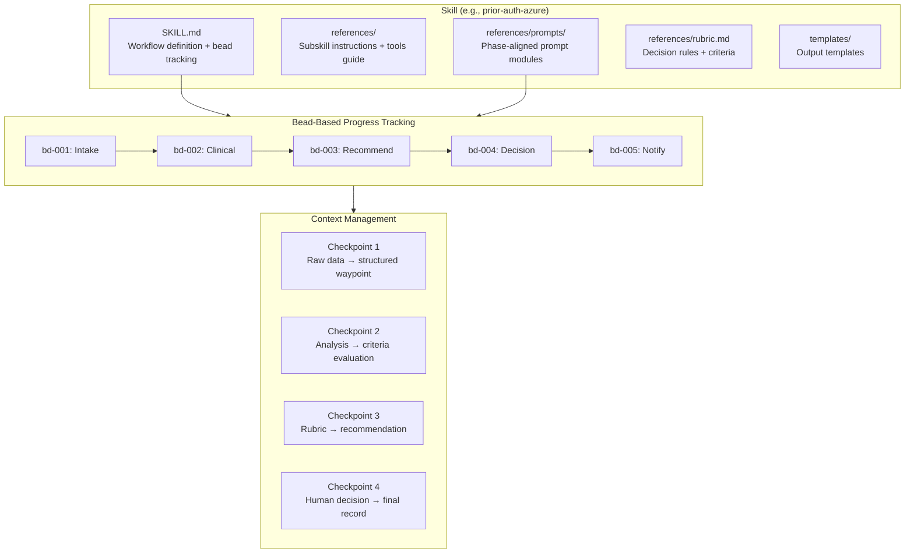
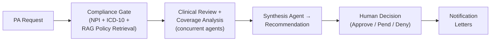

# Healthcare Agent Accelerator for Azure

**A reference architecture for governed production agents in regulated
workflows, demonstrated through healthcare on Azure.**

> **Production agents are governed systems of responsibility, not models with
> tool access.**

This repository shows how to separate agent execution, operational control,
domain policy, capability access, systems of record, and human authority so
each concern can be secured, tested, versioned, and operated independently.

Use it in three ways:

1. **Reference architecture** - adopt explicit responsibility boundaries for
   production-agent systems.
2. **Evaluation framework** - assess whether an agent design has the controls
   and evidence required for consequential work.
3. **Azure accelerator** - study concrete healthcare workflows implemented
   with skills, Microsoft Agent Framework, MCP, APIM, Azure Functions, and
   Azure Health Data Services.

---

## The Problem

Prior Authorization (PA) is one of healthcare’s most broken processes. It sits at the intersection of providers, payors, and patients — and it fails all three.

### By the Numbers

| Stakeholder | Pain Point | Impact |
|-------------|-----------|--------|
| **Providers** | 41 PA requests/week per physician, ~13 hours of staff time | 88% report high/extreme administrative burden |
| **Payors** | 75% of PA tasks remain manual, ~$3.14 per transaction | Up to 75% inaccuracy in manual approval decisions |
| **Patients** | 93% of physicians say PA delays necessary care | 82% treatment abandonment; cancer delays increase mortality 1.2–3.2% |

> Sources: [AMA](https://www.ama-assn.org/), [Sagility Health](https://sagilityhealth.com/), [McKinsey AI Insights](https://www.mckinsey.com/)

### Regulatory Pressure Is Accelerating

**CMS 2026 regulations** now mandate:

- **Real-time data exchange** via HL7 FHIR APIs — 72 hours for urgent, 7 days for standard PA decisions
- **Transparent decision rationale** — payors must provide detailed explanations for every PA outcome
- **FHIR-driven interoperability** across all participating systems

Healthcare organizations need to modernize — but building AI agents that handle clinical data requires more than prompt engineering. It requires **secure infrastructure, compliance-ready patterns, and interoperable tooling**.

---

## What This Project Demonstrates

The project applies one architecture through three complementary views:

- **Responsibility Stack:** who owns each concern.
- **Three Production Planes:** where execution, governance, and human authority
  operate.
- **Governed Agent Lifecycle:** how workflows are defined, admitted, executed,
  checkpointed, decided, observed, and improved.

### Current Maturity

| Capability | Maturity | Current Evidence |
|---|---|---|
| Phase-scoped domain policy | **Implemented** | Skills, prompt modules, rubrics, and templates under `.github/skills/` |
| Durable workflow execution | **Partially implemented** | Agent workflows, bead state, waypoints, and resume behavior exist; bounded retry, idempotency, and version-compatible recovery remain incomplete |
| Scoped capability access | **Implemented** | Consolidated MCP servers and role-specific `allowed_tools` definitions |
| Human decision authority | **Partially implemented** | Prior-auth approval, denial, pending, and override artifacts exist; broader workflow coverage is incomplete |
| Production control plane | **Partially implemented** | APIM OAuth policies, managed identity, diagnostics, and Bicep exist; default passthrough usage and several controls remain incomplete |
| Production evidence | **Partially implemented** | Contract, protocol, latency, and prior-auth runners exist; case coverage, CI enforcement, and operational evidence remain limited |

### What Makes This Different

| Typical Agent Demo | Governed Production-Agent Pattern |
|---|---|
| A model receives a broad tool list | Roles receive narrow capability sets through explicit contracts |
| Conversation history is workflow state | Durable checkpoints record state, evidence, provenance, and progress |
| Policy lives inside a system prompt | Skills and rubrics version domain procedure separately from orchestration |
| Infrastructure is an endpoint | A control plane authenticates, authorizes, constrains, observes, and promotes execution |
| Human review is an informal fallback | Human authority is an explicit architectural plane with attributable decisions |
| Accuracy is the primary proof | Release gates plus outcome, reliability, human, and economic evidence determine readiness |

---

## Intended Business Value

The repository does not claim that the following outcomes have been measured
in production. They are the outcomes the architecture is designed to support
and that a production evaluation program must verify.

### For Healthcare IT Teams

- Reduce administrative effort by automating evidence gathering and draft
  assessment for appropriate cases.
- Shorten turnaround while preserving transparent rationale and human
  authority.
- Reduce manual inconsistency by grounding recommendations in authoritative
  clinical and policy sources.
- Reuse one architecture across GitHub Copilot, Azure AI Foundry, and custom
  agent surfaces.

### For Platform & Security Teams

- **Managed identity pattern** - avoids embedding service credentials in source
  code for supported Azure service connections.
- **APIM control-plane component** - supports JWT validation, routing,
  diagnostics, and future quota and policy controls.
- **Infrastructure as Code** - Bicep and `azd` assets describe the Azure
  deployment.
- **Compliance-oriented design** - uses BAA-eligible Azure services and
  security patterns, but requires organization-specific validation before
  production use.

### For Developers

- **Open protocol** — MCP servers work with any MCP-compatible client, not locked to one vendor
- **Local-first development** — run all four servers locally with `make local-start`
- **Evals built in** — contract validation, latency benchmarks, and native framework evaluation out of the box

---

## Three Production Planes



The planes have asymmetric authority:

- The **agent execution plane** may reason, retrieve, invoke permitted
  capabilities, checkpoint work, and recommend. It cannot grant itself access
  or finalize consequential decisions.
- The **control plane** may permit, constrain, block, route, record, evaluate,
  and promote. It cannot silently substitute infrastructure policy for domain
  or human judgment.
- The **human authority plane** establishes intent and owns attributable
  consequential decisions under control-plane policy.

## Responsibility Stack

| Layer | Owns | Must Not Own | Exposed Contract | Required Evidence | Repository Mapping |
|---|---|---|---|---|---|
| Human authority | Intent, consequential approval, attributable override, accountability | Hidden or unaudited intervention | Authenticated decision and justification | Actor, timestamp, evidence reviewed, decision, override reason | Prior-auth decision and notification phases |
| Experience surfaces | Intent capture, progress display, evidence presentation | Domain policy or infrastructure authorization | Validated request and review interaction | Input validation, user-visible state, decision receipt | GitHub Copilot, Azure AI Foundry, CLI, Gradio |
| Workflow runtime | Coordination, state transitions, concurrency, checkpoints, resume, failure routing | Domain truth or permission grants | Versioned workflow state and transition result | Checkpoints, active versions, transition and recovery records | `src/agents/workflows/` |
| Domain policy | Procedures, rubrics, evidence requirements, schemas, decision criteria | Direct infrastructure access | Versioned skill, rubric, and output schema | Policy version, criteria evaluation, schema result | `.github/skills/` |
| Capability services | Narrow typed operations and external-system integration | Workflow decisions or user authorization | Typed MCP tool request and response | Tool version, authorization context, latency, result or error | `src/mcp-servers/` |
| Systems of record | Durable authoritative facts and records | Agent reasoning | Authoritative API or persistence contract | Record identifiers, source version, timestamps, provenance | FHIR, Cosmos DB, Azure AI Search, external registries |

Governance cuts across every layer: identity, authorization, policy
enforcement, quotas, telemetry, audit correlation, deployment control, and
version management.

## Governed Agent Lifecycle

1. **Define** versioned skills, rubrics, schemas, tool contracts, and
   evaluation criteria.
2. **Admit** authenticated requests under a selected workflow, policy, and
   permitted capability set.
3. **Execute** reasoning and tool calls within permission, time, and cost
   boundaries.
4. **Checkpoint** state, evidence, provenance, active versions, and validation
   results.
5. **Decide** through the human authority plane when outcomes are
   consequential.
6. **Observe** workflow, model, tool, security, latency, cost, and outcome
   telemetry.
7. **Improve** through replay, regression evaluation, versioning, and
   controlled promotion.

### Tiered Failure and Recovery

| Failure Class | Required Response |
|---|---|
| Transient dependency failure | Bounded retry with backoff; resume only from a valid checkpoint |
| Invalid input or contract | Stop and request correction |
| Missing optional evidence | Degrade only when domain policy permits it; record the gap and restrict outcomes |
| Model or schema failure | Reject output, attempt bounded structured regeneration, then escalate |
| Authorization, safety, or policy violation | Fail closed and create an auditable event |
| Uncertain side effect | Reconcile with an idempotency key or route to human review; never replay blindly |

Escalation packages include the original request, completed evidence, latest
valid checkpoint, failure classification, attempted recovery, active workflow,
policy, schema, model, and tool versions, and the recommended next action.

### Production Evidence

Release gates prevent strong aggregate metrics from hiding unacceptable risk:

- No unauthorized data or capability access.
- Required evidence, provenance, and audit lineage are complete.
- Outputs conform to active schema and policy versions.
- Safety-critical outcomes remain within defined thresholds.
- Recovery does not duplicate or lose consequential side effects.

After gates pass, evaluate outcome value, decision quality, operational
reliability, human effectiveness, and economics. Results must be segmented by
workflow, policy, model, tool versions, risk tier, and case cohort.

---

## MCP Servers

The project uses **4 consolidated MCP servers** — each bundles multiple tool domains into a single Azure Function endpoint, reducing deployment surface and simplifying routing. All servers implement MCP Protocol 2025-06-18 with Streamable HTTP transport.

| Server | Port | Tools | Domains | Upstream Data Sources |
|--------|------|-------|---------|----------------------|
| **mcp-reference-data** | 7071 | 12 | NPI, ICD-10, CMS | NPPES Registry, NLM Clinical Tables, CMS Coverage KB |
| **mcp-clinical-research** | 7072 | 20 | FHIR, PubMed, Clinical Trials | Azure FHIR R4, NCBI E-Utilities, ClinicalTrials.gov v2 |
| **cosmos-rag** | 7073 | 6 | Document RAG, Audit Trail | Azure Cosmos DB (DiskANN vectors + BM25 full-text) |
| **document-reader** | 7078 | 1 | File I/O | Local filesystem |

<details>
<summary><strong>mcp-reference-data</strong> — 12 tools</summary>

| Domain | Tool | Description |
|--------|------|-------------|
| NPI | `lookup_npi` | Look up provider by NPI number |
| NPI | `search_providers` | Search providers by name, specialty, location |
| NPI | `validate_npi` | Validate NPI via Luhn algorithm |
| ICD-10 | `validate_icd10` | Validate ICD-10-CM code format and existence |
| ICD-10 | `lookup_icd10` | Look up code description, category, related codes |
| ICD-10 | `search_icd10` | Search codes by keyword |
| ICD-10 | `get_icd10_chapter` | Get codes in a chapter by prefix |
| CMS | `search_coverage` | Search Medicare LCD/NCD coverage policies |
| CMS | `check_medical_necessity` | Check if procedure is medically necessary for diagnosis |
| CMS | `get_coverage_by_cpt` | Get coverage policies for a CPT/HCPCS code |
| CMS | `get_coverage_by_icd10` | Get coverage policies for a diagnosis code |
| CMS | `get_mac_jurisdiction` | Get MAC jurisdiction by state |

</details>

<details>
<summary><strong>mcp-clinical-research</strong> — 20 tools</summary>

| Domain | Tool | Description |
|--------|------|-------------|
| FHIR | `search_patients` | Search patients by name, DOB, identifier |
| FHIR | `get_patient` | Get patient by FHIR resource ID |
| FHIR | `get_patient_conditions` | Get patient's active conditions |
| FHIR | `get_patient_medications` | Get patient's medications |
| FHIR | `get_patient_observations` | Get patient's observations (labs, vitals) |
| FHIR | `get_patient_encounters` | Get patient's encounters |
| FHIR | `search_practitioners` | Search healthcare practitioners |
| FHIR | `validate_resource` | Validate a FHIR resource |
| PubMed | `search_pubmed` | Search PubMed for medical literature |
| PubMed | `search_clinical_queries` | Search with clinical study filters (therapy, diagnosis) |
| PubMed | `get_article` | Get article details by PMID |
| PubMed | `get_article_abstract` | Get article abstract by PMID |
| PubMed | `get_articles_batch` | Batch retrieve multiple articles |
| PubMed | `find_related_articles` | Find related articles by PMID |
| Trials | `search_trials` | Search clinical trials by criteria |
| Trials | `search_by_condition` | Find recruiting trials for a condition near a location |
| Trials | `get_trial` | Get trial details by NCT ID |
| Trials | `get_trial_eligibility` | Get trial eligibility criteria |
| Trials | `get_trial_locations` | Get trial recruiting locations |
| Trials | `get_trial_results` | Get results for completed trials |

</details>

<details>
<summary><strong>cosmos-rag</strong> — 6 tools</summary>

| Tool | Description |
|------|-------------|
| `index_document` | Chunk, embed (text-embedding-3-large), and index documents for RAG |
| `hybrid_search` | Hybrid retrieval: vector (DiskANN) + BM25 full-text with RRF fusion |
| `vector_search` | Pure vector similarity search |
| `record_audit_event` | Record immutable audit event for compliance |
| `get_audit_trail` | Query audit trail by workflow ID |
| `get_session_history` | Query audit history across workflows by type and time range |

</details>

<details>
<summary><strong>document-reader</strong> — 1 tool</summary>

| Tool | Description |
|------|-------------|
| `read_document` | Read local files: text/structured content or base64 for PDFs/images. Workspace-safe by default. |

</details>

---

## Skills & Prompt Engineering

The project uses a **skills layer** that injects domain knowledge, structured
prompt modules, and decision rubrics into AI agent context. Skills are designed
for composability and keep domain procedure separate from workflow runtime.

### Skills Catalog

| Skill | Responsibility | MCP Servers Used |
|---|---|---|
| **prior-auth-azure** | Prior-authorization domain procedure, rubric, and output contract | mcp-reference-data, mcp-clinical-research, cosmos-rag |
| **pa-report-formatter** | Formats assessment and decision artifacts | None |
| **document-reader** | Loads authorized local documents for agent consumption | document-reader |
| **azure-fhir-developer** | FHIR R4 development guidance and Azure authentication patterns | mcp-clinical-research |
| **azure-health-data-services** | DICOM, MedTech, and FHIR integration guidance | mcp-clinical-research |

Clinical-trial protocol generation exists as a two-step runtime workflow in
`src/agents/workflows/clinical_trials.py`. Legacy assets remain under
`.github/skills/clinical-trial-protocol/`, but the directory has no `SKILL.md`
entry point and is not an active skill package. Its older six-bead description
is therefore not part of the implemented skill inventory.

### Prompt Engineering Architecture

Unlike monolithic system prompts, this project uses a **phase-aligned, lazy-loaded prompt architecture** that manages context windows efficiently and ensures consistent, auditable decision-making.



#### Key Design Principles

1. **Lazy module loading** — Prompt modules load only when their workflow phase (bead) starts. Each bead defines which modules to read and which to ignore, keeping context usage minimal.

2. **Context checkpoints** — Waypoint files compress raw data (MCP results, clinical docs, policy text) into structured JSON summaries. Downstream phases read the waypoint, not the raw inputs, preventing context overflow.

3. **Rubric-driven decisions** — Decision logic is externalized into `rubric.md` files. The AI reads the rubric at decision time rather than relying on training data, making criteria transparent, versioned, and auditable.

4. **Bead tracking** — Each workflow phase is tracked as a "bead" with `not-started → in-progress → completed` lifecycle. Bead state persists in waypoint files for resume-from-checkpoint capability.

5. **Context scope rules** — Each bead explicitly defines what data to read and what to ignore, preventing context pollution from upstream phases.

#### Prompt Module Structure (Prior Auth Example)

```
.github/skills/prior-auth-azure/
├── SKILL.md                           # Workflow definition, bead lifecycle, MCP tool guide
├── references/
│   ├── 01-intake-assessment.md        # Subskill 1 instructions
│   ├── 02-decision-notification.md    # Subskill 2 instructions
│   ├── rubric.md                      # Decision criteria and rules
│   ├── tools.md                       # MCP tool usage guide
│   └── prompts/                       # Phase-aligned prompt modules (lazy-loaded)
│       ├── 01-extraction.md           #   Loaded at bead 001 (intake)
│       ├── 02-policy-retrieval.md     #   Loaded at bead 001 (intake)
│       ├── 03-clinical-assessment.md  #   Loaded at bead 002 (clinical)
│       ├── 04-determination.md        #   Loaded at bead 003 (recommend)
│       └── 05-output-formatting.md    #   Loaded at bead 005 (notify)
└── templates/
    └── prior-auth-request.json        # Request template
```

#### Module Loading Timeline

| Phase (Bead) | Modules Loaded | Released After |
|--------------|----------------|----------------|
| Intake (001) | `01-extraction.md` + `02-policy-retrieval.md` | Waypoint write (CP1) |
| Clinical (002) | `03-clinical-assessment.md` | Waypoint update (CP2) |
| Recommend (003) | `04-determination.md` + `rubric.md` | Waypoint finalize (CP3) |
| Decision (004) | *(none — human review)* | Decision write (CP4) |
| Notify (005) | `05-output-formatting.md` | Workflow complete |

---

## Agent Workflows

### Prior Authorization Review

The flagship workflow demonstrates end-to-end PA processing using four specialized agents with concurrent execution and structured audit trails:



**Agents:** Compliance Agent (NPI + ICD-10 validation) → Clinical Reviewer (FHIR + PubMed + Trials) + Coverage Agent (CMS + RAG policies) run concurrently → Synthesis Agent (rubric-driven recommendation). Each phase produces auditable waypoint artifacts. The workflow supports resume-from-checkpoint via bead tracking if interrupted.

### Also Included

- **Clinical Trial Protocol Drafting** - Two-step research and protocol-draft
  workflow using ClinicalTrials.gov and PubMed capabilities.
- **Literature Search** — PubMed-powered research workflows with clinical query filters
- **Patient Data** — FHIR-based patient data retrieval and clinical summarization

---

## Quick Start

### Prerequisites

- Python 3.11+, Node.js 18+, Azure Functions Core Tools v4
- Azure subscription (for cloud deployment)
- GitHub Copilot (for VS Code agent surface)

### Run Locally

```bash
# Start all four MCP servers (ports 7071, 7072, 7073, 7078)
make local-start

# If you deployed with azd, sync local runtime endpoints from azd outputs
make sync-local-env

# Smoke test
curl http://localhost:7071/.well-known/mcp | jq

# Run the prior-auth workflow with sample data
cd src && source agents/.venv/bin/activate
python -m agents --workflow prior-auth --demo --local

# Seed sample payer policies into cosmos-rag (auto-syncs env + starts cosmos-rag)
make seed-data
```

### Deploy to Azure

```bash
azd up
```

This provisions APIM, Azure Functions, Azure Health Data Services, and all supporting infrastructure via Bicep.

### Use in VS Code with Copilot

Configure MCP servers in `.vscode/mcp.json`:

```jsonc
{
  "servers": {
    "healthcare-reference-data":    { "type": "http", "url": "http://localhost:7071/mcp" },
    "healthcare-clinical-research": { "type": "http", "url": "http://localhost:7072/mcp" },
    "healthcare-cosmos-rag":        { "type": "http", "url": "http://localhost:7073/mcp" },
    "healthcare-document-reader":   { "type": "http", "url": "http://localhost:7078/mcp" }
  }
}
```

Then ask in Copilot Chat:

```
Does CPT 27447 require prior auth? Validate the provider NPI and check CMS coverage.
```

---

## Project Structure

```
healthcare-agent-accelerator/
├── .github/skills/                # Domain skills for AI agent context
│   ├── prior-auth-azure/          #   PA review (2 subskills, 5 prompt modules, rubric)
│   │   ├── SKILL.md               #     Workflow + bead tracking + MCP tool guide
│   │   ├── references/prompts/    #     Phase-aligned lazy-loaded prompt modules
│   │   ├── references/rubric.md   #     Externalized decision criteria
│   │   └── templates/             #     Request/output templates
│   ├── pa-report-formatter/       #   Report formatting with Material Design icons
│   ├── document-reader/           #   Local file ingestion (PDF, image, CSV, JSON)
│   ├── azure-fhir-developer/     #   FHIR R4 patterns + Azure auth
│   └── azure-health-data-services/
├── src/
│   ├── mcp-servers/               # Four consolidated MCP servers
│   │   ├── mcp-reference-data/    #   NPI + ICD-10 + CMS (12 tools, port 7071)
│   │   ├── mcp-clinical-research/ #   FHIR + PubMed + Trials (20 tools, port 7072)
│   │   ├── cosmos-rag/            #   RAG + Audit Trail (6 tools, port 7073)
│   │   ├── document-reader/       #   File I/O (1 tool, port 7078)
│   │   └── shared/                #   MCPServer base class + shared utilities
│   └── agents/                    # Multi-agent orchestration (CLI + Gradio UIs)
│       └── workflows/             #   prior_auth, clinical_trials, literature_search, patient_data
├── data/                          # Evaluation cases, policies, sample outputs
│   ├── cases/                     #   10 PA case variants with ground truth
│   ├── policies/                  #   Coverage policy PDFs for RAG indexing
│   └── samples/                   #   Reference output examples
├── deploy/                        # Azure Bicep infrastructure (APIM, Functions, AHDS)
├── scripts/                       # Local launchers, evals, setup CLI, deployment
│   └── setup-cli/                 #   Interactive setup wizard (make setup)
├── tests/                         # Integration tests and evaluation framework
├── docs/                          # Architecture, getting started, OAuth/PRM guides
└── AGENTS.md                      # Operational guide for coding agents
```

---

## Security and Compliance Maturity

| Control | Maturity | Current State |
|---|---|---|
| Entra ID OAuth and JWT validation | **Partially implemented** | OAuth APIM policies exist; the default agent configuration currently targets passthrough endpoints |
| Managed identity | **Implemented** | Azure workloads use managed identities for supported service connections |
| Private networking | **Partially implemented** | Private endpoint modules exist; FHIR private endpoint deployment is currently disabled |
| APIM and Function diagnostics | **Implemented** | Diagnostic settings route platform telemetry to Azure monitoring resources |
| Workflow audit lineage | **Partially implemented** | Waypoints and Cosmos audit tools exist; completeness and failure guarantees require stronger evidence |
| Rate limits, WAF, and production alerting | **Target state** | Documented patterns are not uniformly enforced by the current deployment |
| Healthcare compliance | **Target state** | The design uses compliance-oriented Azure services and patterns but requires organization-specific certification, validation, and clinical governance |

---

## Documentation

| Guide | Description |
|-------|-------------|
| [Getting Started](docs/GETTING-STARTED.md) | Setup, prerequisites, local development, MCP server reference |
| [Skills Flow Map](docs/SKILLS-FLOW-MAP.md) | Mermaid diagrams of all workflow and skill flows |
| [APIM Architecture](docs/architecture/APIM-ARCHITECTURE.md) | Gateway design, security policies, AHDS integration |
| [Retrieval Architecture](docs/architecture/RETRIEVAL-ARCHITECTURE.md) | Cosmos DB, AI Search, OCR+RAG knowledge layer |
| [MCP OAuth + PRM](docs/MCP-OAUTH-PRM.md) | OAuth / Protected Resource Metadata behavior |
| [Infrastructure](deploy/README.md) | Bicep modules and deployment details |

---

## Acknowledgements & Inspirations

This project builds on ideas from several pioneering efforts in healthcare AI:

- **[Anthropic — Claude for Health AI](https://www.anthropic.com/research/claude-for-health-ai)** — demonstrated LLM-powered prior authorization, clinical trial matching, and medical coding validation
- **[AutoAuth Solution Accelerator](https://azure-samples.github.io/autoauth-solution-accelerator/)** — Azure-native PA automation with OCR, hybrid retrieval, and AI reasoning
- **[Model Context Protocol (MCP)](https://modelcontextprotocol.io/docs)** — the open protocol enabling portable, model-agnostic tool integrations
- **[Azure Health Data Services](https://learn.microsoft.com/en-us/azure/healthcare-apis/)** — FHIR R4, DICOM, and MedTech on Azure
- **[Azure AI Foundry MCP Integration](https://learn.microsoft.com/en-us/azure/ai-foundry/agents/how-to/tools/model-context-protocol)** — native MCP support in Azure AI agents

---

## Disclaimer

This accelerator uses **de-identified sample data only** and is not validated for clinical use. AI-generated recommendations are draft outputs that always require human clinical review. Do not use this software for real healthcare decisions without proper validation, regulatory review, and clinical oversight.

## License

MIT
