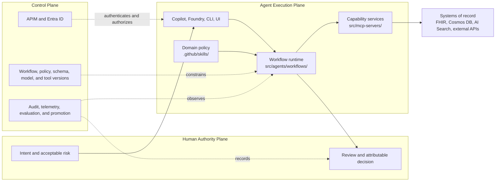
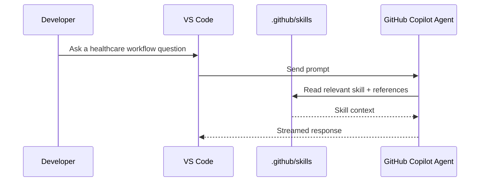
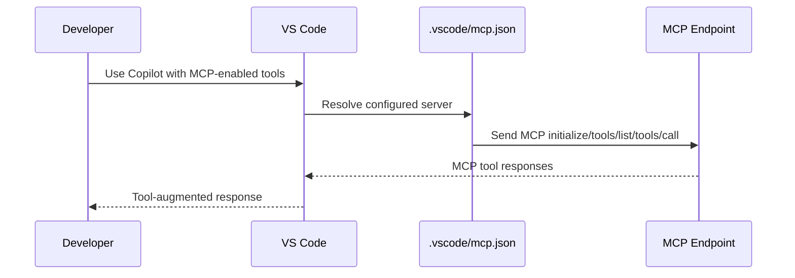
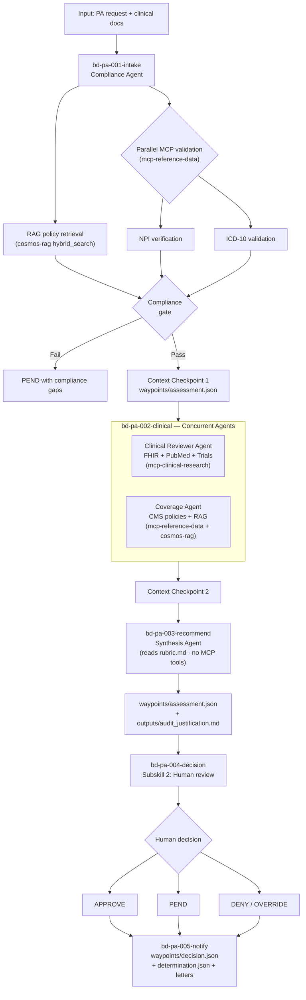
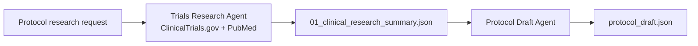
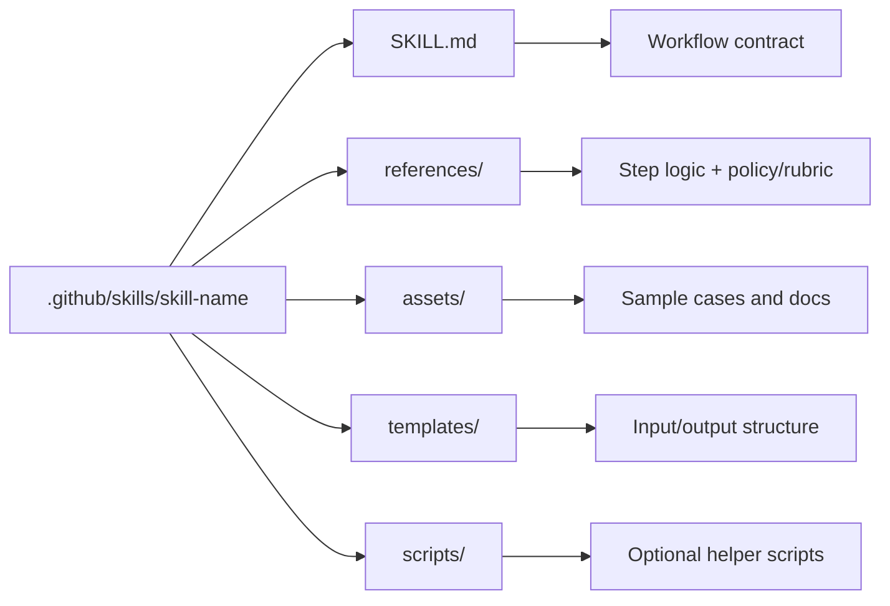
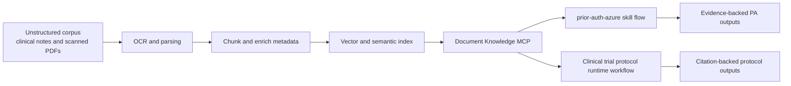
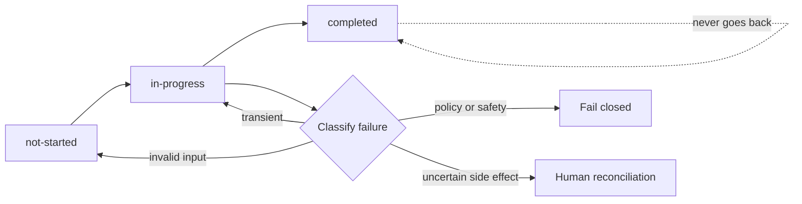

# Skills Flow Map

This document maps the repository's skills and workflows to the production
agent responsibility model defined in [`README.md`](../README.md).

## 1) Production-Agent Responsibility Map



| Responsibility | Repository Owner |
|---|---|
| Human approval and override | Prior-auth decision and notification phases |
| User interaction | Copilot, Foundry, CLI, and development UIs |
| Workflow state and orchestration | `src/agents/workflows/` |
| Domain procedure and decision policy | `.github/skills/` |
| External capabilities | `src/mcp-servers/` |
| Identity, gateway policy, telemetry, deployment | APIM, Entra ID, Bicep, Azure Monitor |
| Authoritative facts and durable records | FHIR, Cosmos DB, AI Search, external registries |

## 2) Copilot Skills Loading Path



Notes:
- No custom VS Code chat participant is required.
- Skill routing is model-driven from repository context in `.github/skills`.

## 3) Native Copilot MCP Path (`mcp.json`)



## 4) Prior Authorization Across the Three Planes

| Plane | Prior-Authorization Responsibility |
|---|---|
| Agent execution | Compliance, clinical, coverage, and synthesis work; checkpoint persistence |
| Control | Actor and tool authorization, version selection, telemetry, audit correlation, evaluation |
| Human authority | Final approve, pend, deny, or attributable override |

The current workflow strongly demonstrates agent execution and human authority.
Control-plane enforcement and production evidence are only partially
implemented and must not be inferred from the workflow diagram alone.

## 5) Prior Authorization Skill Flow

Source files:
- `.github/skills/prior-auth-azure/SKILL.md`
- `.github/skills/prior-auth-azure/references/01-intake-assessment.md`
- `.github/skills/prior-auth-azure/references/02-decision-notification.md`
- `.github/skills/prior-auth-azure/references/rubric.md`



### Prior Auth Bead Tracking

| Bead ID | Phase | Agent | Status Persisted In |
|---------|-------|-------|---------------------|
| `bd-pa-001-intake` | RAG retrieval + NPI/ICD-10 compliance gate | Compliance Agent | `waypoints/assessment.json` |
| `bd-pa-002-clinical` | Clinical review + CMS coverage (concurrent) | Clinical Reviewer + Coverage Agent | `waypoints/assessment.json` |
| `bd-pa-003-recommend` | Synthesis → recommendation + audit doc | Synthesis Agent | `waypoints/assessment.json` |
| `bd-pa-004-decision` | Human review + decision capture | Human | `waypoints/decision.json` |
| `bd-pa-005-notify` | Determination JSON + notification letters | (code generation) | `waypoints/decision.json` |

## 6) Clinical Trial Protocol Workflow

Current source files:

- `src/agents/workflows/clinical_trials.py`
- `src/agents/agents.py`
- `src/agents/tools.py`



| Responsibility | Current Mechanism | Maturity |
|---|---|---|
| Research execution | Trials Research Agent with scoped clinical-research tools | **Implemented** |
| Research checkpoint | `01_clinical_research_summary.json` | **Implemented** |
| Protocol draft | Draft agent using research output | **Implemented** |
| Final checkpoint | `protocol_draft.json` | **Implemented** |
| Six-bead skill package and resume model | Inactive legacy assets; `.github/skills/clinical-trial-protocol/` has no `SKILL.md` | **Target state** |

## 7) Skills Directory Anatomy



## 8) OCR and RAG Knowledge Layer Extension



Adoption touchpoints:
- MCP layer: add a document-knowledge server and register it in `.vscode/mcp.json`.
- Skill layer: add retrieval prerequisites in `SKILL.md` and tool definitions in `references/tools.md`.
- Prompt layer: require retrieval before synthesis and enforce source citations.

## 9) Workflow Progress Tracking

The prior-auth skill uses bead tracking for durable multi-step execution. The
current clinical-trial runtime uses two sequential waypoints and does not have
the previously documented six-bead skill package.



Recovery from a checkpoint is valid only when completed operations are
idempotent or reconciled and the active workflow, policy, schema, model, and
tool versions remain compatible.

### Rules

1. **One active bead** at a time (only one `in-progress`)
2. **Sequential execution** — beads complete in order
3. **Persisted in waypoints** — bead state is written to JSON waypoint files under a `"beads"` key
4. **Resume from beads** — on startup, read bead array and resume from first non-completed bead
5. **Audit trail** — each completed bead records a `completed_at` timestamp

### Governed Lifecycle Mapping

| Lifecycle Stage | Current Workflow Mechanism | Maturity |
|---|---|---|
| Define | Skills, prompt modules, rubrics, templates | **Implemented** |
| Admit | CLI input parsing and workflow selection | **Partially implemented** |
| Execute | Agent Framework orchestration and scoped MCP tools | **Implemented** |
| Checkpoint | Waypoint JSON and bead state | **Implemented** |
| Decide | Prior-auth human decision and override artifacts | **Partially implemented** |
| Observe | Logs, audit tool calls, and evaluation runners | **Partially implemented** |
| Improve | Manual evaluation and version changes; controlled promotion loop is not present | **Target state** |

Bead state is an execution-plane mechanism. It does not replace control-plane
authorization, operational telemetry, or human accountability.

### Bead State Schema

```json
{
  "beads": [
    {"id": "bd-XX-NNN-name", "status": "completed", "completed_at": "2026-02-10T12:00:00Z"},
    {"id": "bd-XX-NNN-name", "status": "in-progress", "started_at": "2026-02-10T12:05:00Z"},
    {"id": "bd-XX-NNN-name", "status": "not-started"}
  ]
}
```

### Workflow Tracking Registry

| Workflow or Skill | Tracking Model | Maturity |
|---|---|---|
| Prior Authorization | Five beads in `assessment.json` and `decision.json` | **Implemented** |
| Clinical Trial Protocol Runtime | Research and protocol-draft waypoints | **Implemented** |
| Clinical Trial Six-Bead Skill | Inactive legacy assets without `SKILL.md` | **Target state** |

---

## 10) Practical Reading Order

1. Open `SKILL.md` for orchestration rules.
2. Follow `references/*.md` in execution order.
3. Use `data/sample_cases/prior_auth_baseline/*` for test runs.
4. Validate MCP connectivity in `.vscode/mcp.json`.
5. Run workflow and inspect `waypoints/*`.
