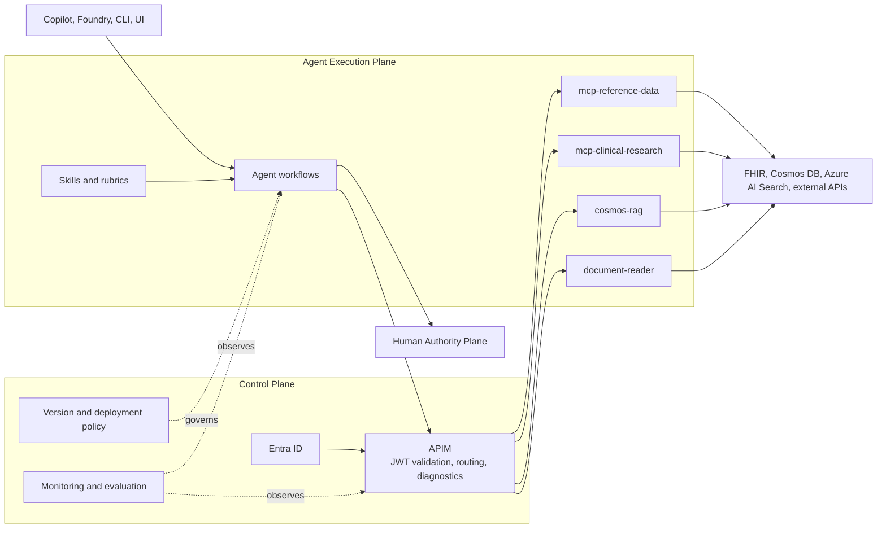
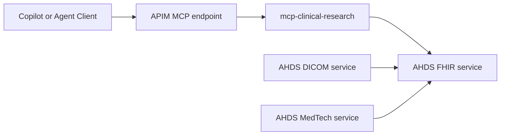

# Azure API Management Architecture for Healthcare MCP Servers

## Overview

Azure API Management is one component of the production-agent control plane.
It provides gateway identity, request policy, routing, and diagnostics for MCP
capability services. It does not own workflow state, domain policy, model
behavior, evaluation promotion, or human authority.

This document uses three maturity labels:

- **Implemented:** present in executable infrastructure or policy.
- **Partially implemented:** present but not uniformly enforced or proven.
- **Target state:** recommended architecture that is not currently operating
  across the deployment.

For the canonical production-agent narrative, see
[`README.md`](../../README.md).

## Azure Healthcare Agent Architecture



## APIM Responsibility Boundary

| APIM Owns | APIM Does Not Own |
|---|---|
| Token validation and gateway authorization | Domain decision criteria |
| Backend routing and credential injection | Workflow state and resume |
| Request quotas and gateway policy when configured | Model selection and prompt policy |
| Gateway diagnostics and correlation identifiers | Human approval or override |
| Public API exposure and backend isolation | End-to-end outcome evaluation |

APIM policy is necessary but insufficient for a production-agent control
plane. Version catalogs, evaluation gates, incident controls, and promotion
policy must be provided by the broader platform.

## APIM Configuration Strategy

### Azure Health Data Services and FHIR API Fit

The consolidated `mcp-clinical-research` capability service is the bridge
between APIM-exposed FHIR tools and Azure Health Data Services (AHDS).



### Practical Integration Points in This Repo

1. AHDS deployment:
- `deploy/infra/modules/health-data-services.bicep` creates the AHDS workspace and FHIR R4 service.
2. FHIR URL injection:
- `deploy/infra/main.bicep` passes `healthDataServices.outputs.fhirServerUrl` into the Function Apps module.
- `deploy/infra/modules/function-apps.bicep` sets `FHIR_SERVER_URL` for each MCP Function App.
3. Runtime behavior:
- `src/mcp-servers/mcp-clinical-research/fhir_tools.py` reads the configured
  FHIR endpoint.
- If configured, it uses `DefaultAzureCredential` and calls the FHIR endpoint.
- If not configured, it falls back to demo behavior/public test server responses.
4. Authorization:
- `deploy/infra/main.bicep` assigns `FHIR Data Contributor` role to MCP Function App identities.

### Junior Developer Mental Model

- AHDS Workspace is the healthcare data platform boundary.
- FHIR service is the normalized API layer your MCP tools query.
- APIM is the secure front door that exposes MCP endpoints to clients.
- `mcp-clinical-research` is where FHIR MCP requests become FHIR REST calls.

When debugging FHIR behavior, check this order:

1. `FHIR_SERVER_URL` app setting is set.
2. Function App identity has `FHIR Data Contributor`.
3. Network path (APIM or direct Function App) can reach the FHIR endpoint.
4. MCP `tools/call` response includes real FHIR data instead of demo fallback.

### 1. API Products

Define API products to group MCP servers by use case:

```yaml
products:
  - name: healthcare-mcp-basic
    displayName: Healthcare MCP Basic
    description: Basic healthcare MCP tools for development
    apis:
      - reference-data
    subscriptionRequired: true
    approvalRequired: false

  - name: healthcare-mcp-clinical
    displayName: Healthcare MCP Clinical
    description: Clinical workflow MCP tools
    apis:
      - clinical-research
      - cosmos-rag
    subscriptionRequired: true
    approvalRequired: true  # Requires approval for PHI-capable APIs
```

### 2. Security Policies

### Current Control Maturity

| Control | Maturity | Evidence or Gap |
|---|---|---|
| OAuth PRM and JWT policy assets | **Implemented** | `deploy/infra/modules/apim-mcp-oauth.bicep` and `deploy/infra/policies/mcp-api.policy.xml` |
| Default agent access path | **Partially implemented** | `src/agents/config.py` defaults to APIM passthrough endpoints |
| APIM diagnostics | **Implemented** | APIM diagnostic resources are defined in Bicep |
| Rate limiting and quotas | **Target state** | Examples are documented but not uniformly present in deployed policy |
| IP filtering and WAF | **Target state** | Recommended controls, not current universal enforcement |
| FHIR private connectivity | **Partially implemented** | Private endpoint module exists; deployment currently disables the FHIR private endpoint |
| Monitoring dashboard and alerts | **Target state** | Queries are documented; operational dashboard and alert coverage remain incomplete |

#### OAuth 2.0 / Microsoft Entra ID Integration

```xml
<inbound>
    <base />
    <!-- Validate JWT token from Microsoft Entra ID -->
    <validate-azure-ad-token tenant-id="{{tenant-id}}">
        <client-application-ids>
            <application-id>{{copilot-app-id}}</application-id>
            <application-id>{{foundry-app-id}}</application-id>
        </client-application-ids>
        <audiences>
            <audience>api://healthcare-mcp-gateway</audience>
        </audiences>
    </validate-azure-ad-token>

    <!-- Extract claims for audit logging -->
    <set-variable name="userId" value="@(context.Request.Headers.GetValueOrDefault("Authorization","").Split(' ').Last().AsJwt()?.Claims.GetValueOrDefault("oid", "anonymous"))" />
</inbound>
```

#### Rate Limiting Policy

> **Target state:** The following rate-limit policy demonstrates the intended
> control-plane behavior; it is not currently enforced across every MCP API.

```xml
<inbound>
    <rate-limit-by-key
        calls="100"
        renewal-period="60"
        counter-key="@(context.Subscription?.Key ?? context.Request.IpAddress)"
        increment-condition="@(context.Response.StatusCode >= 200 && context.Response.StatusCode < 400)" />

    <!-- Burst protection for MCP operations -->
    <quota-by-key
        calls="10000"
        renewal-period="86400"
        counter-key="@(context.Subscription?.Key ?? "anonymous")" />
</inbound>
```

### 3. MCP Endpoint Mapping

| Capability Service | OAuth Path | Passthrough Path | Backend |
|---|---|---|---|
| Reference data | `{gateway}/mcp/reference-data/mcp` | `{gateway}/mcp-pt/reference-data/mcp` | `mcp-reference-data` Function App |
| Clinical research | `{gateway}/mcp/clinical-research/mcp` | `{gateway}/mcp-pt/clinical-research/mcp` | `mcp-clinical-research` Function App |
| RAG and audit | `{gateway}/mcp/cosmos-rag/mcp` | `{gateway}/mcp-pt/cosmos-rag/mcp` | `cosmos-rag` Function App |
| Document reading | Deployment-specific | Deployment-specific | `document-reader` service |

The OAuth path is the intended production access path. The current Python
agent configuration defaults to the passthrough base path, so runtime access
is **Partially implemented** relative to the target control-plane model.

### 4. Backend Configuration

```bicep
resource apimBackend 'Microsoft.ApiManagement/service/backends@2023-05-01-preview' = {
  name: 'reference-data-backend'
  parent: apimService
  properties: {
    description: 'Consolidated reference-data MCP capability service'
    url: 'https://${referenceDataFunctionApp.properties.defaultHostName}'
    protocol: 'http'
    credentials: {
      header: {
        'x-functions-key': ['{{reference-data-function-key}}']
      }
    }
    tls: {
      validateCertificateChain: true
      validateCertificateName: true
    }
  }
}
```

## MCP Protocol Support via APIM

### Request Transformation

Transform incoming MCP requests to match Azure Function endpoints:

```xml
<inbound>
    <!-- Parse MCP JSON-RPC request -->
    <set-variable name="mcpMethod" value="@{
        var body = context.Request.Body.As<JObject>(preserveContent: true);
        return body["method"]?.ToString() ?? "";
    }" />

    <!-- Route to appropriate backend based on MCP method -->
    <choose>
        <when condition="@(context.Variables.GetValueOrDefault<string>("mcpMethod").StartsWith("tools/"))">
            <set-backend-service backend-id="mcp-tools-backend" />
        </when>
        <when condition="@(context.Variables.GetValueOrDefault<string>("mcpMethod").StartsWith("resources/"))">
            <set-backend-service backend-id="mcp-resources-backend" />
        </when>
    </choose>
</inbound>
```

### Response Transformation

Ensure MCP-compliant responses:

```xml
<outbound>
    <base />
    <!-- Ensure JSON-RPC 2.0 response format -->
    <set-header name="Content-Type" exists-action="override">
        <value>application/json</value>
    </set-header>

    <!-- Add MCP-specific headers -->
    <set-header name="X-MCP-Version" exists-action="override">
        <value>1.0</value>
    </set-header>
</outbound>
```

## Audit and Compliance

> **Partially implemented:** APIM and Function diagnostic resources exist, and
> workflows can write audit events. End-to-end lineage completeness, alerting,
> retention policy, and recovery guarantees still require production evidence.

### HIPAA Compliance Considerations

1. **Implemented:** TLS 1.2+ on APIM endpoints.
2. **Partially implemented:** APIM and Function diagnostics; end-to-end audit
   completeness requires production evidence.
3. **Partially implemented:** OAuth-protected endpoints exist alongside
   passthrough development endpoints.
4. **Target state:** Organization-approved region, retention, privacy, and
   compliance configuration.

### Audit Log Policy

```xml
<inbound>
    <log-to-eventhub logger-id="healthcare-audit-logger">@{
        return new JObject(
            new JProperty("timestamp", DateTime.UtcNow.ToString("o")),
            new JProperty("correlationId", context.RequestId),
            new JProperty("userId", context.Variables.GetValueOrDefault<string>("userId")),
            new JProperty("operation", context.Operation.Id),
            new JProperty("api", context.Api.Id),
            new JProperty("clientIp", context.Request.IpAddress),
            new JProperty("subscriptionId", context.Subscription?.Id ?? "none")
        ).ToString();
    }</log-to-eventhub>
</inbound>
```

## Deployment Architecture

### Infrastructure as Code (Bicep)

```
deploy/infra/
├── main.bicep                 # Main deployment orchestrator
├── modules/
│   ├── apim.bicep            # APIM instance configuration
│   ├── apim-mcp-oauth.bicep  # OAuth MCP APIs and PRM resources
│   ├── function-apps.bicep   # Consolidated MCP Function Apps
│   └── private-endpoints.bicep
└── policies/
    └── mcp-api.policy.xml    # JWT validation policy
```

### Environment Endpoints

> **Target state:** Use environment-specific gateway names and policy
> promotion. The table below is a naming convention, not evidence that all
> three environments are currently deployed.

| Environment | APIM Gateway URL |
|-------------|------------------|
| Development | `healthcare-mcp-dev.azure-api.net` |
| Staging | `healthcare-mcp-staging.azure-api.net` |
| Production | `healthcare-mcp.azure-api.net` |

## Integration with MCP Clients

### Consolidated MCP Configuration

MCP-compatible clients can use the consolidated OAuth endpoints. Exact token
configuration is client-specific:

```json
{
  "name": "healthcare",
  "version": "1.0.0",
  "mcpServers": {
    "healthcare-reference-data": {
      "url": "https://<gateway>/mcp/reference-data/mcp",
      "transport": "streamable-http",
      "headers": {
        "Authorization": "Bearer ${AZURE_MCP_TOKEN}"
      }
    }
  }
}
```

### Token Acquisition

For GitHub Copilot integration, tokens are acquired via:

1. **VS Code Extension**: Uses VS Code's authentication API for Microsoft Entra ID
2. **Azure AI Foundry**: Uses managed identity or service principal
3. **Direct CLI**: Uses `az account get-access-token --resource api://healthcare-mcp-gateway`

## Monitoring and Observability

> **Target state:** The metrics and queries below define the intended
> control-plane view. The repository does not currently provide a complete
> production dashboard or alert set.

### Key Metrics

- **Request Latency**: P50, P95, P99 for each MCP operation
- **Error Rate**: 4xx and 5xx responses by API
- **Throughput**: Requests/second by subscription
- **Token Validation**: Success/failure rates

### Azure Monitor Dashboard

```kusto
// MCP Operations Summary
ApiManagementGatewayLogs
| where ApiId contains "healthcare"
| summarize
    TotalRequests = count(),
    SuccessRate = round(100.0 * countif(ResponseCode < 400) / count(), 2),
    AvgLatency = avg(TotalTime),
    P95Latency = percentile(TotalTime, 95)
  by bin(TimeGenerated, 1h), OperationId
| order by TimeGenerated desc
```

## Runtime Access Paths

| Path | Intended Use | Maturity |
|---|---|---|
| OAuth MCP endpoints | Shared and production-oriented clients | **Partially implemented** |
| APIM passthrough endpoints | Development and compatibility testing | **Implemented** |
| Direct Function endpoints | Local or isolated development only; bypasses APIM controls | **Implemented** |

## Security Best Practices

1. **Implemented:** Entra ID token validation and managed-identity patterns.
2. **Partially implemented:** Private endpoint infrastructure and
   least-privilege role assignments.
3. **Target state:** Uniform key rotation through Key Vault.
4. **Target state:** WAF and additional ingress protection.
5. **Target state:** Production DDoS, alerting, and incident-response controls.

## Cost Optimization

> **Target state:** These are operating recommendations, not controls proven by
> the current repository evidence.

1. **Tier Selection**: Start with Developer tier, scale to Standard/Premium
2. **Caching**: Enable response caching for read-heavy operations (ICD-10 lookups)
3. **Consumption Monitoring**: Set alerts for quota usage
4. **Reserved Capacity**: Consider reserved pricing for production workloads

---

## Current-State Summary

| Capability | Maturity |
|---|---|
| APIM Bicep and MCP backend registration | **Implemented** |
| Entra ID OAuth and PRM policy assets | **Implemented** |
| APIM and Function diagnostics | **Implemented** |
| Uniform OAuth path for agent runtimes | **Partially implemented** |
| FHIR private connectivity | **Partially implemented** |
| Rate limits, WAF, and IP filtering | **Target state** |
| Production dashboards, alerts, and SLOs | **Target state** |
| Broader version, evaluation, promotion, rollback, and kill controls | **Target state** |

---

## Current Consolidated Endpoint Verification

The infrastructure assets register three consolidated capability services:

| Service | Function App |
|---|---|
| `reference-data` | `mcp-reference-data` |
| `clinical-research` | `mcp-clinical-research` |
| `cosmos-rag` | `cosmos-rag` |

Use the OAuth path for shared production-oriented clients and the passthrough
path for development and compatibility checks.

### Prerequisites

- MCP servers deployed and running (Azure Functions)
- MCP Protocol version `2025-06-18` (required by APIM)
- Streamable HTTP transport on `/mcp` endpoint

### VS Code MCP Configuration

After registration, add to `.vscode/mcp.json`:

```json
{
  "servers": {
    "healthcare-reference-data": {
      "type": "http",
      "url": "https://{apim-name}.azure-api.net/mcp-pt/reference-data/mcp",
      "headers": {
        "Ocp-Apim-Subscription-Key": "${input:apimSubscriptionKey}"
      }
    },
    "healthcare-clinical-research": {
      "type": "http",
      "url": "https://{apim-name}.azure-api.net/mcp-pt/clinical-research/mcp",
      "headers": {
        "Ocp-Apim-Subscription-Key": "${input:apimSubscriptionKey}"
      }
    },
    "healthcare-rag": {
      "type": "http",
      "url": "https://{apim-name}.azure-api.net/mcp-pt/cosmos-rag/mcp",
      "headers": {
        "Ocp-Apim-Subscription-Key": "${input:apimSubscriptionKey}"
      }
    }
  },
  "inputs": [
    {
      "id": "apimSubscriptionKey",
      "type": "promptString",
      "description": "APIM Subscription Key for Healthcare MCP APIs",
      "password": true
    }
  ]
}
```

### Alternative: Direct Function App Access (Development)

For development without APIM, you can connect directly to the Function Apps:

```json
{
  "servers": {
    "healthcare-reference-data-direct": {
      "type": "http",
      "url": "https://{base}-mcp-reference-data-func.azurewebsites.net/mcp"
    }
  }
}
```

> **Note**: Direct access bypasses APIM policies (rate limiting, authentication). Only use for development.

### Verifying MCP Server Registration

Test with curl:

```bash
# List available tools
curl -X POST "https://{apim-name}.azure-api.net/mcp-pt/reference-data/mcp" \
  -H "Content-Type: application/json" \
  -H "Ocp-Apim-Subscription-Key: {key}" \
  -d '{"jsonrpc": "2.0", "method": "tools/list", "id": 1}'

# Call a tool
curl -X POST "https://{apim-name}.azure-api.net/mcp-pt/reference-data/mcp" \
  -H "Content-Type: application/json" \
  -H "Ocp-Apim-Subscription-Key: {key}" \
  -d '{"jsonrpc": "2.0", "method": "tools/call", "params": {"name": "lookup_npi", "arguments": {"npi": "1234567890"}}, "id": 2}'
```
