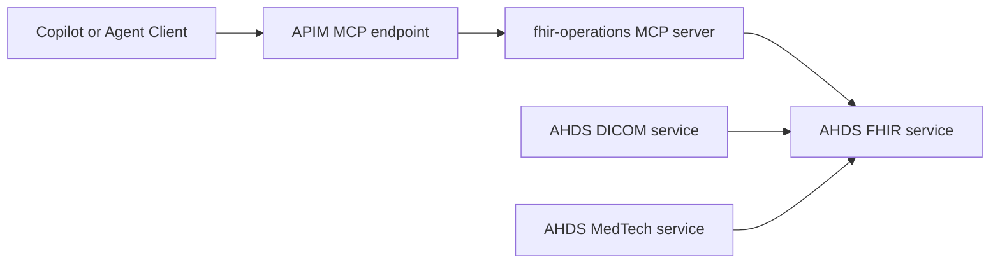

# Azure API Management Architecture for Healthcare MCP Servers

## Overview

This document outlines how Azure API Management (APIM) provides the secure gateway layer for exposing MCP (Model Context Protocol) servers, replacing the hosted endpoints from the Anthropic architecture (mcp.deepsense.ai, pubmed.mcp.claude.com).

## Architecture Comparison

### Anthropic Healthcare Marketplace (Reference)
```
┌──────────────────────────────────────────────────────────────────┐
│                    Claude Code / Claude Desktop                  │
├──────────────────────────────────────────────────────────────────┤
│  Skills (Static Knowledge)      │    MCP Plugins (Dynamic)       │
│  ├── fhir-developer-skill       │    ├── cms-coverage            │
│  ├── prior-auth-review-skill    │    │   └── mcp.deepsense.ai    │
│  └── clinical-trial-protocol    │    ├── npi-registry            │
│                                 │    │   └── mcp.deepsense.ai    │
│                                 │    ├── pubmed                  │
│                                 │    │   └── pubmed.mcp.claude.com
│                                 │    └── icd10-codes             │
└──────────────────────────────────────────────────────────────────┘
```

### Azure Healthcare Marketplace (Target)
```
┌─────────────────────────────────────────────────────────────────┐
│         GitHub Copilot / Azure AI Foundry Agents                │
├─────────────────────────────────────────────────────────────────┤
│  Skills (Static Knowledge)      │    MCP Servers (Dynamic)      │
│  ├── azure-fhir-developer       │    via Azure APIM Gateway     │
│  ├── prior-auth-azure           │                               │
│  ├── azure-health-data-services │    ┌─────────────────────────┐│
│  └── clinical-trial-protocol    │    │  APIM Gateway Layer     ││
│                                 │    │  ├── OAuth 2.0 / JWT    ││
│                                 │    │  ├── Rate Limiting      ││
│                                 │    │  ├── IP Filtering       ││
│                                 │    │  └── Audit Logging      ││
│                                 │    └─────────┬───────────────┘│
│                                 │              │                │
│                                 │    ┌─────────▼───────────────┐│
│                                 │    │ Backend MCP Servers     ││
│                                 │    │ (Azure Functions/       ││
│                                 │    │  Container Apps)        ││
│                                 │    │ ├── cms-coverage-mcp    ││
│                                 │    │ ├── npi-registry-mcp    ││
│                                 │    │ ├── fhir-operations-mcp ││
│                                 │    │ ├── icd10-codes-mcp     ││
│                                 │    │ └── clinical-trials-mcp ││
│                                 │    └─────────────────────────┘│
└─────────────────────────────────────────────────────────────────┘
```

## APIM Configuration Strategy

### Azure Health Data Services and FHIR API Fit

The `fhir-operations` MCP server is the bridge between APIM-exposed MCP tools and Azure Health Data Services (AHDS) FHIR data.



### Practical Integration Points in This Repo

1. AHDS deployment:
- `deploy/infra/modules/health-data-services.bicep` creates the AHDS workspace and FHIR R4 service.
2. FHIR URL injection:
- `deploy/infra/main.bicep` passes `healthDataServices.outputs.fhirServerUrl` into the Function Apps module.
- `deploy/infra/modules/function-apps.bicep` sets `FHIR_SERVER_URL` for each MCP Function App.
3. Runtime behavior:
- `src/mcp-servers/fhir-operations/function_app.py` reads `FHIR_SERVER_URL`.
- If configured, it uses `DefaultAzureCredential` and calls the FHIR endpoint.
- If not configured, it falls back to demo behavior/public test server responses.
4. Authorization:
- `deploy/infra/main.bicep` assigns `FHIR Data Contributor` role to MCP Function App identities.

### Junior Developer Mental Model

- AHDS Workspace is the healthcare data platform boundary.
- FHIR service is the normalized API layer your MCP tools query.
- APIM is the secure front door that exposes MCP endpoints to clients.
- `fhir-operations` MCP is where MCP requests become FHIR REST calls.

When debugging FHIR behavior, check this order:

1. `FHIR_SERVER_URL` app setting is set.
2. Function App identity has `FHIR Data Contributor`.
3. Network path (APIM or direct Function App) can reach the FHIR endpoint.
4. MCP `tools/call` response includes real FHIR data instead of demo fallback.

### 1. API Products

Define API products to group MCP servers by use case:

```yaml
products:
  - name: healthcare-mcp-basic
    displayName: Healthcare MCP Basic
    description: Basic healthcare MCP tools for development
    apis:
      - fhir-operations
      - icd10-codes
    subscriptionRequired: true
    approvalRequired: false

  - name: healthcare-mcp-clinical
    displayName: Healthcare MCP Clinical
    description: Clinical workflow MCP tools
    apis:
      - cms-coverage
      - npi-registry
      - clinical-trials
    subscriptionRequired: true
    approvalRequired: true  # Requires approval for PHI-capable APIs
```

### 2. Security Policies

#### OAuth 2.0 / Microsoft Entra ID Integration

```xml
<inbound>
    <base />
    <!-- Validate JWT token from Microsoft Entra ID -->
    <validate-azure-ad-token tenant-id="{{tenant-id}}">
        <client-application-ids>
            <application-id>{{copilot-app-id}}</application-id>
            <application-id>{{foundry-app-id}}</application-id>
        </client-application-ids>
        <audiences>
            <audience>api://healthcare-mcp-gateway</audience>
        </audiences>
    </validate-azure-ad-token>

    <!-- Extract claims for audit logging -->
    <set-variable name="userId" value="@(context.Request.Headers.GetValueOrDefault("Authorization","").Split(' ').Last().AsJwt()?.Claims.GetValueOrDefault("oid", "anonymous"))" />
</inbound>
```

#### Rate Limiting Policy

```xml
<inbound>
    <rate-limit-by-key
        calls="100"
        renewal-period="60"
        counter-key="@(context.Subscription?.Key ?? context.Request.IpAddress)"
        increment-condition="@(context.Response.StatusCode >= 200 && context.Response.StatusCode < 400)" />

    <!-- Burst protection for MCP operations -->
    <quota-by-key
        calls="10000"
        renewal-period="86400"
        counter-key="@(context.Subscription?.Key ?? "anonymous")" />
</inbound>
```

### 3. MCP Server URL Mapping

| Anthropic MCP Server | Azure APIM Endpoint | Backend Service |
|---------------------|---------------------|-----------------|
| `mcp.deepsense.ai/cms_coverage/mcp` | `{apim}.azure-api.net/healthcare/cms-coverage` | Azure Function: `cms-coverage-mcp` |
| `mcp.deepsense.ai/npi_registry/mcp` | `{apim}.azure-api.net/healthcare/npi-registry` | Azure Function: `npi-registry-mcp` |
| `pubmed.mcp.claude.com/mcp` | `{apim}.azure-api.net/healthcare/pubmed` | Azure Function: `pubmed-search-mcp` |
| (new) | `{apim}.azure-api.net/healthcare/fhir` | Container App: `fhir-operations-mcp` |
| (new) | `{apim}.azure-api.net/healthcare/icd10` | Azure Function: `icd10-codes-mcp` |
| (new) | `{apim}.azure-api.net/healthcare/clinical-trials` | Azure Function: `clinical-trials-mcp` |

### 4. Backend Configuration

```bicep
resource apimBackend 'Microsoft.ApiManagement/service/backends@2023-05-01-preview' = {
  name: 'cms-coverage-mcp-backend'
  parent: apimService
  properties: {
    description: 'CMS Coverage MCP Server'
    url: 'https://${cmsCoverageFunctionApp.properties.defaultHostName}/api'
    protocol: 'http'
    credentials: {
      header: {
        'x-functions-key': ['{{cms-coverage-function-key}}']
      }
    }
    tls: {
      validateCertificateChain: true
      validateCertificateName: true
    }
  }
}
```

## MCP Protocol Support via APIM

### Request Transformation

Transform incoming MCP requests to match Azure Function endpoints:

```xml
<inbound>
    <!-- Parse MCP JSON-RPC request -->
    <set-variable name="mcpMethod" value="@{
        var body = context.Request.Body.As<JObject>(preserveContent: true);
        return body["method"]?.ToString() ?? "";
    }" />

    <!-- Route to appropriate backend based on MCP method -->
    <choose>
        <when condition="@(context.Variables.GetValueOrDefault<string>("mcpMethod").StartsWith("tools/"))">
            <set-backend-service backend-id="mcp-tools-backend" />
        </when>
        <when condition="@(context.Variables.GetValueOrDefault<string>("mcpMethod").StartsWith("resources/"))">
            <set-backend-service backend-id="mcp-resources-backend" />
        </when>
    </choose>
</inbound>
```

### Response Transformation

Ensure MCP-compliant responses:

```xml
<outbound>
    <base />
    <!-- Ensure JSON-RPC 2.0 response format -->
    <set-header name="Content-Type" exists-action="override">
        <value>application/json</value>
    </set-header>

    <!-- Add MCP-specific headers -->
    <set-header name="X-MCP-Version" exists-action="override">
        <value>1.0</value>
    </set-header>
</outbound>
```

## Audit and Compliance

### HIPAA Compliance Considerations

1. **Encryption in Transit**: TLS 1.2+ enforced on all APIM endpoints
2. **Audit Logging**: All MCP requests logged to Azure Monitor
3. **Access Control**: RBAC + OAuth 2.0 for all API access
4. **Data Residency**: Deploy APIM in compliant Azure regions

### Audit Log Policy

```xml
<inbound>
    <log-to-eventhub logger-id="healthcare-audit-logger">@{
        return new JObject(
            new JProperty("timestamp", DateTime.UtcNow.ToString("o")),
            new JProperty("correlationId", context.RequestId),
            new JProperty("userId", context.Variables.GetValueOrDefault<string>("userId")),
            new JProperty("operation", context.Operation.Id),
            new JProperty("api", context.Api.Id),
            new JProperty("clientIp", context.Request.IpAddress),
            new JProperty("subscriptionId", context.Subscription?.Id ?? "none")
        ).ToString();
    }</log-to-eventhub>
</inbound>
```

## Deployment Architecture

### Infrastructure as Code (Bicep)

```
infrastructure/
├── main.bicep                 # Main deployment orchestrator
├── modules/
│   ├── apim.bicep            # APIM instance configuration
│   ├── apim-apis.bicep       # API definitions
│   ├── apim-policies.bicep   # Policy fragments
│   ├── functions.bicep       # Azure Functions for MCP servers
│   └── container-apps.bicep  # Container Apps for complex MCP servers
└── parameters/
    ├── dev.parameters.json
    ├── staging.parameters.json
    └── prod.parameters.json
```

### Environment Endpoints

| Environment | APIM Gateway URL |
|-------------|------------------|
| Development | `healthcare-mcp-dev.azure-api.net` |
| Staging | `healthcare-mcp-staging.azure-api.net` |
| Production | `healthcare-mcp.azure-api.net` |

## Integration with Claude Code / GitHub Copilot

### MCP Plugin Configuration

The `.claude-plugin/marketplace.json` will reference Azure APIM endpoints:

```json
{
  "name": "healthcare",
  "version": "1.0.0",
  "mcpServers": {
    "cms-coverage": {
      "url": "https://healthcare-mcp.azure-api.net/cms-coverage/mcp",
      "transport": "sse",
      "headers": {
        "Authorization": "Bearer ${AZURE_MCP_TOKEN}"
      }
    }
  }
}
```

### Token Acquisition

For GitHub Copilot integration, tokens are acquired via:

1. **VS Code Extension**: Uses VS Code's authentication API for Microsoft Entra ID
2. **Azure AI Foundry**: Uses managed identity or service principal
3. **Direct CLI**: Uses `az account get-access-token --resource api://healthcare-mcp-gateway`

## Monitoring and Observability

### Key Metrics

- **Request Latency**: P50, P95, P99 for each MCP operation
- **Error Rate**: 4xx and 5xx responses by API
- **Throughput**: Requests/second by subscription
- **Token Validation**: Success/failure rates

### Azure Monitor Dashboard

```kusto
// MCP Operations Summary
ApiManagementGatewayLogs
| where ApiId contains "healthcare"
| summarize
    TotalRequests = count(),
    SuccessRate = round(100.0 * countif(ResponseCode < 400) / count(), 2),
    AvgLatency = avg(TotalTime),
    P95Latency = percentile(TotalTime, 95)
  by bin(TimeGenerated, 1h), OperationId
| order by TimeGenerated desc
```

## Migration Path from Anthropic MCP Servers

### Phase 1: Parallel Operation
1. Deploy Azure APIM with MCP backends
2. Test with new endpoints while original servers remain active
3. Validate feature parity

### Phase 2: Gradual Migration
1. Update skill files to use Azure endpoints
2. Add fallback logic for resilience
3. Monitor for issues

### Phase 3: Full Cutover
1. Remove references to external MCP servers
2. Update all documentation
3. Deprecate old configurations

## Security Best Practices

1. **Least Privilege**: Subscription keys scoped to specific APIs
2. **Rotation**: Automatic key rotation via Key Vault
3. **Network Isolation**: Private endpoints for backend services
4. **WAF Integration**: Azure Front Door or Application Gateway for additional protection
5. **DDoS Protection**: Azure DDoS Protection Standard enabled

## Cost Optimization

1. **Tier Selection**: Start with Developer tier, scale to Standard/Premium
2. **Caching**: Enable response caching for read-heavy operations (ICD-10 lookups)
3. **Consumption Monitoring**: Set alerts for quota usage
4. **Reserved Capacity**: Consider reserved pricing for production workloads

---

## Progress

1. [x] Create Bicep templates for APIM deployment
2. [x] Implement MCP server backends (Azure Functions)
3. [x] Configure OAuth 2.0 with Microsoft Entra ID
4. [ ] Set up monitoring dashboards
5. [x] Document authentication flow for consumers

---

## APIM MCP Server Configuration (Post-Deployment)

After deploying the infrastructure with `azd provision` and `azd deploy`, you need to configure the MCP servers in APIM.

### Option 1: Automated Setup Script (Recommended)

The repository includes automated scripts that run after `azd deploy`:

```bash
# Scripts are run automatically via azd postdeploy hook
# Or run manually:
cd scripts
pip install -r requirements.txt
python setup_mcp_servers.py

# Or use the bash script:
./setup-mcp-servers.sh
```

The scripts will:
1. Create APIM backends for each Function App
2. Create MCP-compatible APIs with proper operations
3. Apply MCP policies (CORS, headers, error handling)
4. Add APIs to the healthcare-mcp product
5. Generate VS Code `.vscode/mcp.json` configuration

### Option 2: Azure Portal (Manual)

For each MCP server (npi-lookup, icd10-validation, cms-coverage, fhir-operations, pubmed, clinical-trials):

1. **Navigate to APIM** in the Azure Portal
2. Go to **APIs** > **MCP Servers** > **+ Create MCP server**
3. Select **Expose an existing MCP server**
4. Configure the backend:

   | Server | Backend MCP Server URL |
   |--------|------------------------|
   | NPI Lookup | `https://{base}-npi-lookup-func.azurewebsites.net/api/mcp` |
   | ICD-10 Validation | `https://{base}-icd10-validation-func.azurewebsites.net/api/mcp` |
   | CMS Coverage | `https://{base}-cms-coverage-func.azurewebsites.net/api/mcp` |
   | FHIR Operations | `https://{base}-fhir-operations-func.azurewebsites.net/api/mcp` |
   | PubMed | `https://{base}-pubmed-func.azurewebsites.net/api/mcp` |
   | Clinical Trials | `https://{base}-clinical-trials-func.azurewebsites.net/api/mcp` |

5. Set **Transport type** to **Streamable HTTP**
6. Configure the MCP server name and base path (e.g., `npi-lookup-mcp`, path: `mcp/npi`)
7. Click **Create**

### Prerequisites

- MCP servers deployed and running (Azure Functions)
- MCP Protocol version `2025-06-18` (required by APIM)
- Streamable HTTP transport on `/mcp` endpoint

### VS Code MCP Configuration

After registration, add to `.vscode/mcp.json`:

```json
{
  "servers": {
    "healthcare-npi": {
      "type": "http",
      "url": "https://{apim-name}.azure-api.net/npi-lookup-mcp/mcp",
      "headers": {
        "Ocp-Apim-Subscription-Key": "${input:apimSubscriptionKey}"
      }
    },
    "healthcare-icd10": {
      "type": "http",
      "url": "https://{apim-name}.azure-api.net/icd10-validation-mcp/mcp",
      "headers": {
        "Ocp-Apim-Subscription-Key": "${input:apimSubscriptionKey}"
      }
    },
    "healthcare-cms": {
      "type": "http",
      "url": "https://{apim-name}.azure-api.net/cms-coverage-mcp/mcp",
      "headers": {
        "Ocp-Apim-Subscription-Key": "${input:apimSubscriptionKey}"
      }
    },
    "healthcare-fhir": {
      "type": "http",
      "url": "https://{apim-name}.azure-api.net/fhir-operations-mcp/mcp",
      "headers": {
        "Ocp-Apim-Subscription-Key": "${input:apimSubscriptionKey}"
      }
    },
    "healthcare-pubmed": {
      "type": "http",
      "url": "https://{apim-name}.azure-api.net/pubmed-mcp/mcp",
      "headers": {
        "Ocp-Apim-Subscription-Key": "${input:apimSubscriptionKey}"
      }
    },
    "healthcare-clinical-trials": {
      "type": "http",
      "url": "https://{apim-name}.azure-api.net/clinical-trials-mcp/mcp",
      "headers": {
        "Ocp-Apim-Subscription-Key": "${input:apimSubscriptionKey}"
      }
    }
  },
  "inputs": [
    {
      "id": "apimSubscriptionKey",
      "type": "promptString",
      "description": "APIM Subscription Key for Healthcare MCP APIs",
      "password": true
    }
  ]
}
```

### Alternative: Direct Function App Access (Development)

For development without APIM, you can connect directly to the Function Apps:

```json
{
  "servers": {
    "healthcare-npi-direct": {
      "type": "http",
      "url": "https://{base}-npi-lookup-func.azurewebsites.net/api/mcp"
    }
  }
}
```

> **Note**: Direct access bypasses APIM policies (rate limiting, authentication). Only use for development.

### Verifying MCP Server Registration

Test with curl:

```bash
# List available tools
curl -X POST "https://{apim-name}.azure-api.net/npi-lookup-mcp/mcp" \
  -H "Content-Type: application/json" \
  -H "Ocp-Apim-Subscription-Key: {key}" \
  -d '{"jsonrpc": "2.0", "method": "tools/list", "id": 1}'

# Call a tool
curl -X POST "https://{apim-name}.azure-api.net/npi-lookup-mcp/mcp" \
  -H "Content-Type: application/json" \
  -H "Ocp-Apim-Subscription-Key: {key}" \
  -d '{"jsonrpc": "2.0", "method": "tools/call", "params": {"name": "lookup_npi", "arguments": {"npi": "1234567890"}}, "id": 2}'
```
