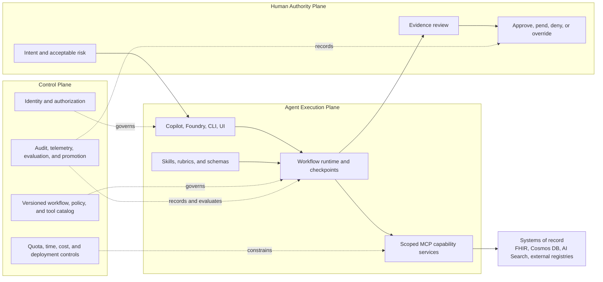
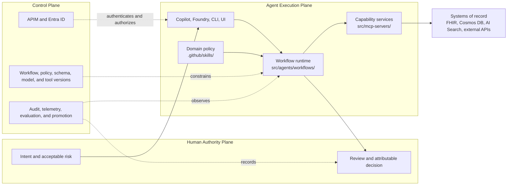
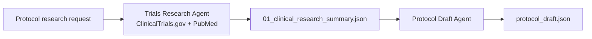
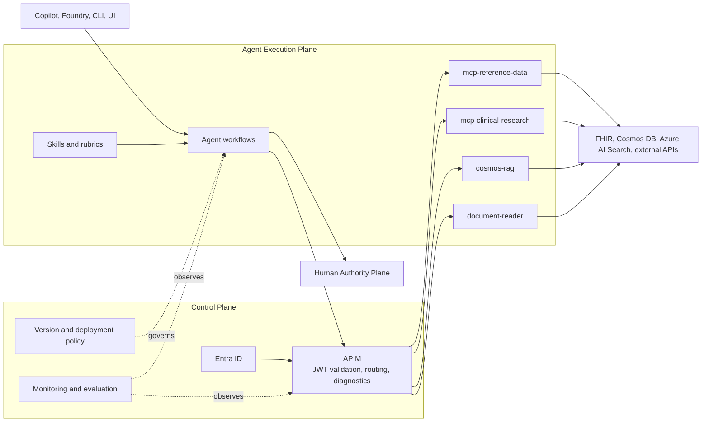
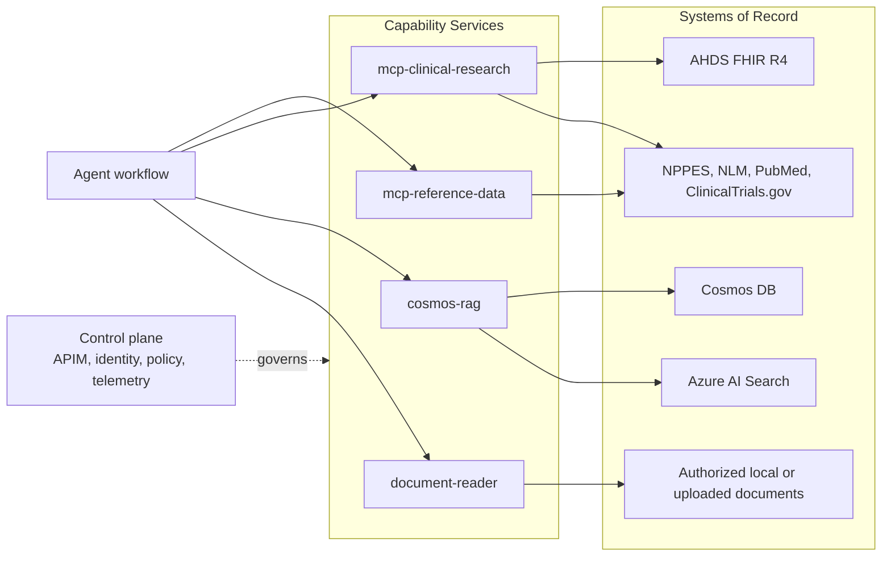

# Production Agent Responsibility Narrative Implementation Plan

> **For agentic workers:** REQUIRED SUB-SKILL: Use superpowers:subagent-driven-development (recommended) or superpowers:executing-plans to implement this plan task-by-task. Steps use checkbox (`- [ ]`) syntax for tracking.

**Goal:** Reframe the repository documentation around an explicit, evidence-based point of view for governed production agents without changing runtime code or overstating current maturity.

**Architecture:** `README.md` becomes the canonical executive and technical narrative. Four supporting documents expand the same Responsibility Stack, three production planes, governed lifecycle, failure model, and gated evidence scorecard while clearly separating implemented, partially implemented, and target-state capabilities.

**Tech Stack:** GitHub-flavored Markdown, Mermaid diagrams, existing Python documentation checks, ripgrep, Git.

---

## File Structure

Only these files change:

- `README.md` - canonical thesis, three-plane overview, Responsibility Stack,
  governed lifecycle, failure model, maturity disclosure, and evidence
  scorecard.
- `docs/SKILLS-FLOW-MAP.md` - maps skills and workflows to the three planes and
  governed lifecycle.
- `docs/architecture/APIM-ARCHITECTURE.md` - explains APIM as one control-plane
  component and labels current versus target-state controls.
- `docs/architecture/RETRIEVAL-ARCHITECTURE.md` - distinguishes capability
  services from systems of record and updates the consolidated MCP mapping.
- `docs/DECOMPLEX-PERF-EVALS.md` - documents the gated balanced scorecard and
  current evaluation evidence without implying stronger coverage than exists.

Do not modify runtime code, infrastructure, CI, tests, deployment files, or
other documentation. Record contradictions outside these files as follow-up
work.

### Task 1: Establish the Canonical README Narrative

**Files:**
- Modify: `README.md:1-133`
- Modify: `README.md:218-334`
- Modify: `README.md:432-446`

- [ ] **Step 1: Capture the missing-thesis baseline**

Run:

```bash
rg -n "Production agents are governed systems of responsibility" README.md
```

Expected: no matches and exit code 1.

- [ ] **Step 2: Replace the opening positioning**

Replace the title, subtitle, and introductory copy before `## The Problem` with:

```markdown
# Healthcare Agent Accelerator for Azure

**A reference architecture for governed production agents in regulated
workflows, demonstrated through healthcare on Azure.**

> **Production agents are governed systems of responsibility, not models with
> tool access.**

This repository shows how to separate agent execution, operational control,
domain policy, capability access, systems of record, and human authority so
each concern can be secured, tested, versioned, and operated independently.

Use it in three ways:

1. **Reference architecture** - adopt explicit responsibility boundaries for
   production-agent systems.
2. **Evaluation framework** - assess whether an agent design has the controls
   and evidence required for consequential work.
3. **Azure accelerator** - study concrete healthcare workflows implemented
   with skills, Microsoft Agent Framework, MCP, APIM, Azure Functions, and
   Azure Health Data Services.
```

Keep the existing healthcare problem statement after this new introduction.

- [ ] **Step 3: Replace `What This Project Does` and differentiation claims**

Replace `## What This Project Does` through the end of
`### What Makes This Different` with:

```markdown
## What This Project Demonstrates

The project applies one architecture through three complementary views:

- **Responsibility Stack:** who owns each concern.
- **Three Production Planes:** where execution, governance, and human authority
  operate.
- **Governed Agent Lifecycle:** how workflows are defined, admitted, executed,
  checkpointed, decided, observed, and improved.

### Current Maturity

| Capability | Maturity | Current Evidence |
|---|---|---|
| Phase-scoped domain policy | **Implemented** | Skills, prompt modules, rubrics, and templates under `.github/skills/` |
| Durable workflow execution | **Partially implemented** | Agent workflows, bead state, waypoints, and resume behavior exist; bounded retry, idempotency, and version-compatible recovery remain incomplete |
| Scoped capability access | **Implemented** | Consolidated MCP servers and role-specific `allowed_tools` definitions |
| Human decision authority | **Partially implemented** | Prior-auth approval, denial, pending, and override artifacts exist; broader workflow coverage is incomplete |
| Production control plane | **Partially implemented** | APIM OAuth policies, managed identity, diagnostics, and Bicep exist; default passthrough usage and several controls remain incomplete |
| Production evidence | **Partially implemented** | Contract, protocol, latency, and prior-auth runners exist; case coverage, CI enforcement, and operational evidence remain limited |

### What Makes This Different

| Typical Agent Demo | Governed Production-Agent Pattern |
|---|---|
| A model receives a broad tool list | Roles receive narrow capability sets through explicit contracts |
| Conversation history is workflow state | Durable checkpoints record state, evidence, provenance, and progress |
| Policy lives inside a system prompt | Skills and rubrics version domain procedure separately from orchestration |
| Infrastructure is an endpoint | A control plane authenticates, authorizes, constrains, observes, and promotes execution |
| Human review is an informal fallback | Human authority is an explicit architectural plane with attributable decisions |
| Accuracy is the primary proof | Release gates plus outcome, reliability, human, and economic evidence determine readiness |
```

- [ ] **Step 4: Qualify the business-value section**

Rename `## Business Value` to:

```markdown
## Intended Business Value

The repository does not claim that the following outcomes have been measured
in production. They are the outcomes the architecture is designed to support
and that a production evaluation program must verify.
```

Keep the audience subsections, but change unsupported quantified bullets to
non-quantified target outcomes:

```markdown
### For Healthcare IT Teams

- Reduce administrative effort by automating evidence gathering and draft
  assessment for appropriate cases.
- Shorten turnaround while preserving transparent rationale and human
  authority.
- Reduce manual inconsistency by grounding recommendations in authoritative
  clinical and policy sources.
- Reuse one architecture across GitHub Copilot, Azure AI Foundry, and custom
  agent surfaces.
```

In `### For Platform & Security Teams`, replace absolute statements with:

```markdown
- **Managed identity pattern** - avoids embedding service credentials in source
  code for supported Azure service connections.
- **APIM control-plane component** - supports JWT validation, routing,
  diagnostics, and future quota and policy controls.
- **Infrastructure as Code** - Bicep and `azd` assets describe the Azure
  deployment.
- **Compliance-oriented design** - uses BAA-eligible Azure services and
  security patterns, but requires organization-specific validation before
  production use.
```

- [ ] **Step 5: Replace the architecture diagram with the three-plane model**

Replace the current `## Architecture` diagram with:

````markdown
## Three Production Planes



The planes have asymmetric authority:

- The **agent execution plane** may reason, retrieve, invoke permitted
  capabilities, checkpoint work, and recommend. It cannot grant itself access
  or finalize consequential decisions.
- The **control plane** may permit, constrain, block, route, record, evaluate,
  and promote. It cannot silently substitute infrastructure policy for domain
  or human judgment.
- The **human authority plane** establishes intent and owns attributable
  consequential decisions under control-plane policy.
````

Use four backticks around the outer Markdown example while editing so the
nested Mermaid fence remains three backticks in the final file.

- [ ] **Step 6: Add the Responsibility Stack**

Insert immediately after the three-plane section:

```markdown
## Responsibility Stack

| Layer | Owns | Must Not Own | Exposed Contract | Required Evidence | Repository Mapping |
|---|---|---|---|---|---|
| Human authority | Intent, consequential approval, attributable override, accountability | Hidden or unaudited intervention | Authenticated decision and justification | Actor, timestamp, evidence reviewed, decision, override reason | Prior-auth decision and notification phases |
| Experience surfaces | Intent capture, progress display, evidence presentation | Domain policy or infrastructure authorization | Validated request and review interaction | Input validation, user-visible state, decision receipt | GitHub Copilot, Azure AI Foundry, CLI, Gradio |
| Workflow runtime | Coordination, state transitions, concurrency, checkpoints, resume, failure routing | Domain truth or permission grants | Versioned workflow state and transition result | Checkpoints, active versions, transition and recovery records | `src/agents/workflows/` |
| Domain policy | Procedures, rubrics, evidence requirements, schemas, decision criteria | Direct infrastructure access | Versioned skill, rubric, and output schema | Policy version, criteria evaluation, schema result | `.github/skills/` |
| Capability services | Narrow typed operations and external-system integration | Workflow decisions or user authorization | Typed MCP tool request and response | Tool version, authorization context, latency, result or error | `src/mcp-servers/` |
| Systems of record | Durable authoritative facts and records | Agent reasoning | Authoritative API or persistence contract | Record identifiers, source version, timestamps, provenance | FHIR, Cosmos DB, Azure AI Search, external registries |

Governance cuts across every layer: identity, authorization, policy
enforcement, quotas, telemetry, audit correlation, deployment control, and
version management.
```

- [ ] **Step 7: Add lifecycle, failure, and evidence summaries**

Insert before `## MCP Servers`:

```markdown
## Governed Agent Lifecycle

1. **Define** versioned skills, rubrics, schemas, tool contracts, and
   evaluation criteria.
2. **Admit** authenticated requests under a selected workflow, policy, and
   permitted capability set.
3. **Execute** reasoning and tool calls within permission, time, and cost
   boundaries.
4. **Checkpoint** state, evidence, provenance, active versions, and validation
   results.
5. **Decide** through the human authority plane when outcomes are
   consequential.
6. **Observe** workflow, model, tool, security, latency, cost, and outcome
   telemetry.
7. **Improve** through replay, regression evaluation, versioning, and
   controlled promotion.

### Tiered Failure and Recovery

| Failure Class | Required Response |
|---|---|
| Transient dependency failure | Bounded retry with backoff; resume only from a valid checkpoint |
| Invalid input or contract | Stop and request correction |
| Missing optional evidence | Degrade only when domain policy permits it; record the gap and restrict outcomes |
| Model or schema failure | Reject output, attempt bounded structured regeneration, then escalate |
| Authorization, safety, or policy violation | Fail closed and create an auditable event |
| Uncertain side effect | Reconcile with an idempotency key or route to human review; never replay blindly |

Escalation packages include the original request, completed evidence, latest
valid checkpoint, failure classification, attempted recovery, active workflow,
policy, schema, model, and tool versions, and the recommended next action.

### Production Evidence

Release gates prevent strong aggregate metrics from hiding unacceptable risk:

- No unauthorized data or capability access.
- Required evidence, provenance, and audit lineage are complete.
- Outputs conform to active schema and policy versions.
- Safety-critical outcomes remain within defined thresholds.
- Recovery does not duplicate or lose consequential side effects.

After gates pass, evaluate outcome value, decision quality, operational
reliability, human effectiveness, and economics. Results must be segmented by
workflow, policy, model, tool versions, risk tier, and case cohort.
```

- [ ] **Step 8: Correct the current skills and workflow inventory**

In `## Skills & Prompt Engineering`, keep only the five skill packages that
exist under `.github/skills/`:

```markdown
### Skills Catalog

| Skill | Responsibility | MCP Servers Used |
|---|---|---|
| **prior-auth-azure** | Prior-authorization domain procedure, rubric, and output contract | mcp-reference-data, mcp-clinical-research, cosmos-rag |
| **pa-report-formatter** | Formats assessment and decision artifacts | None |
| **document-reader** | Loads authorized local documents for agent consumption | document-reader |
| **azure-fhir-developer** | FHIR R4 development guidance and Azure authentication patterns | mcp-clinical-research |
| **azure-health-data-services** | DICOM, MedTech, and FHIR integration guidance | mcp-clinical-research |

Clinical-trial protocol generation exists as a two-step runtime workflow in
`src/agents/workflows/clinical_trials.py`. Legacy assets remain under
`.github/skills/clinical-trial-protocol/`, but the directory has no `SKILL.md`
entry point and is not an active skill package. Its older six-bead description
is therefore not part of the implemented skill inventory.
```

Under `### Also Included`, replace the clinical-trial bullet with:

```markdown
- **Clinical Trial Protocol Drafting** - Two-step research and protocol-draft
  workflow using ClinicalTrials.gov and PubMed capabilities.
```

- [ ] **Step 9: Replace the security table with maturity-aware language**

Replace `## Security & Compliance` with:

```markdown
## Security and Compliance Maturity

| Control | Maturity | Current State |
|---|---|---|
| Entra ID OAuth and JWT validation | **Partially implemented** | OAuth APIM policies exist; the default agent configuration currently targets passthrough endpoints |
| Managed identity | **Implemented** | Azure workloads use managed identities for supported service connections |
| Private networking | **Partially implemented** | Private endpoint modules exist; FHIR private endpoint deployment is currently disabled |
| APIM and Function diagnostics | **Implemented** | Diagnostic settings route platform telemetry to Azure monitoring resources |
| Workflow audit lineage | **Partially implemented** | Waypoints and Cosmos audit tools exist; completeness and failure guarantees require stronger evidence |
| Rate limits, WAF, and production alerting | **Target state** | Documented patterns are not uniformly enforced by the current deployment |
| Healthcare compliance | **Target state** | The design uses compliance-oriented Azure services and patterns but requires organization-specific certification, validation, and clinical governance |
```

- [ ] **Step 10: Verify the README narrative**

Run:

```bash
rg -n "Production agents are governed systems of responsibility|## Three Production Planes|## Responsibility Stack|## Governed Agent Lifecycle|## Security and Compliance Maturity" README.md
```

Expected: one match for each phrase or heading.

Run:

```bash
rg -n "40% reduction|75% fewer|HIPAA-ready|APIM as the single front door" README.md
```

Expected: no matches.

Run:

```bash
rg -n "clinical-trial-protocol|Six domain skills|six domain skills|Clinical Trial Matching" README.md
```

Expected: the only `clinical-trial-protocol` match is the explicit statement
that legacy assets exist without an active `SKILL.md`; the other terms have no
matches.

- [ ] **Step 11: Commit the canonical narrative**

```bash
git add README.md
git commit -m "docs: establish production agent responsibility narrative" \
  -m "Co-authored-by: Copilot <223556219+Copilot@users.noreply.github.com>" \
  -m "Copilot-Session: d6719ffa-3d68-4fc2-abfc-3212638fc708"
```

### Task 2: Map Skills and Workflows to the Narrative

**Files:**
- Modify: `docs/SKILLS-FLOW-MAP.md:1-220`

- [ ] **Step 1: Capture the missing-plane baseline**

Run:

```bash
rg -n "Human Authority Plane|Control Plane|Governed Lifecycle Mapping" docs/SKILLS-FLOW-MAP.md
```

Expected: no matches and exit code 1.

- [ ] **Step 2: Replace the opening system-flow section**

Replace `## 1) System Flow (Copilot + MCP)` with:

````markdown
## 1) Production-Agent Responsibility Map

For the canonical production-agent thesis and maturity model, see
[`README.md`](../README.md).



| Responsibility | Repository Owner |
|---|---|
| Human approval and override | Prior-auth decision and notification phases |
| User interaction | Copilot, Foundry, CLI, and development UIs |
| Workflow state and orchestration | `src/agents/workflows/` |
| Domain procedure and decision policy | `.github/skills/` |
| External capabilities | `src/mcp-servers/` |
| Identity, gateway policy, telemetry, deployment | APIM, Entra ID, Bicep, Azure Monitor |
| Authoritative facts and durable records | FHIR, Cosmos DB, AI Search, external registries |
````

- [ ] **Step 3: Add responsibility annotations to the prior-auth flow**

Immediately before `## 4) Prior Authorization Skill Flow`, add:

```markdown
## 4) Prior Authorization Across the Three Planes

| Plane | Prior-Authorization Responsibility |
|---|---|
| Agent execution | Compliance, clinical, coverage, and synthesis work; checkpoint persistence |
| Control | Actor and tool authorization, version selection, telemetry, audit correlation, evaluation |
| Human authority | Final approve, pend, deny, or attributable override |

The current workflow strongly demonstrates agent execution and human authority.
Control-plane enforcement and production evidence are only partially
implemented and must not be inferred from the workflow diagram alone.
```

Renumber the existing prior-auth heading to `## 5)` and subsequent numbered
headings sequentially.

- [ ] **Step 4: Add lifecycle mapping to bead tracking**

Before the existing bead state schema, add:

```markdown
### Governed Lifecycle Mapping

| Lifecycle Stage | Current Workflow Mechanism | Maturity |
|---|---|---|
| Define | Skills, prompt modules, rubrics, templates | **Implemented** |
| Admit | CLI input parsing and workflow selection | **Partially implemented** |
| Execute | Agent Framework orchestration and scoped MCP tools | **Implemented** |
| Checkpoint | Waypoint JSON and bead state | **Implemented** |
| Decide | Prior-auth human decision and override artifacts | **Partially implemented** |
| Observe | Logs, audit tool calls, and evaluation runners | **Partially implemented** |
| Improve | Manual evaluation and version changes; controlled promotion loop is not present | **Target state** |

Bead state is an execution-plane mechanism. It does not replace control-plane
authorization, operational telemetry, or human accountability.
```

- [ ] **Step 5: Replace the retry-only bead diagram**

Replace:

```markdown
IP -.->|error/retry| IP
```

with:

```markdown
IP --> CLASSIFY{Classify failure}
CLASSIFY -->|transient| IP
CLASSIFY -->|invalid input| NS
CLASSIFY -->|policy or safety| STOP[Fail closed]
CLASSIFY -->|uncertain side effect| HUMAN[Human reconciliation]
```

Add this note below the diagram:

```markdown
Recovery from a checkpoint is valid only when completed operations are
idempotent or reconciled and the active workflow, policy, schema, model, and
tool versions remain compatible.
```

- [ ] **Step 6: Replace the stale clinical-trial skill flow**

Replace the existing `Clinical Trial Protocol Skill Flow` section and its
six-bead table with:

````markdown
## 6) Clinical Trial Protocol Workflow

Current source files:

- `src/agents/workflows/clinical_trials.py`
- `src/agents/agents.py`
- `src/agents/tools.py`



| Responsibility | Current Mechanism | Maturity |
|---|---|---|
| Research execution | Trials Research Agent with scoped clinical-research tools | **Implemented** |
| Research checkpoint | `01_clinical_research_summary.json` | **Implemented** |
| Protocol draft | Draft agent using research output | **Implemented** |
| Final checkpoint | `protocol_draft.json` | **Implemented** |
| Six-bead skill package and resume model | Inactive legacy assets; `.github/skills/clinical-trial-protocol/` has no `SKILL.md` | **Target state** |
````

Update later section numbering after this replacement.

In the OCR and RAG diagram, replace the clinical-trial skill node with:

```markdown
CTWF[Clinical trial protocol runtime workflow]
```

Replace the statement `All skills use beads` with:

```markdown
The prior-auth skill uses bead tracking for durable multi-step execution. The
current clinical-trial runtime uses two sequential waypoints and does not have
the previously documented six-bead skill package.
```

Replace the skill bead registry with:

```markdown
| Workflow or Skill | Tracking Model | Maturity |
|---|---|---|
| Prior Authorization | Five beads in `assessment.json` and `decision.json` | **Implemented** |
| Clinical Trial Protocol Runtime | Research and protocol-draft waypoints | **Implemented** |
| Clinical Trial Six-Bead Skill | Inactive legacy assets without `SKILL.md` | **Target state** |
```

- [ ] **Step 7: Verify terminology and commit**

Run:

```bash
rg -n "Production-Agent Responsibility Map|Prior Authorization Across the Three Planes|Governed Lifecycle Mapping|Human reconciliation|Clinical Trial Protocol Workflow|Inactive legacy assets" docs/SKILLS-FLOW-MAP.md
```

Expected: all six phrases are present.

Run:

```bash
rg -n "trials_search|trials_details|clinical-trial-protocol/SKILL.md|bd-ct-|All skills use beads|CTP\\[" docs/SKILLS-FLOW-MAP.md
```

Expected: no matches.

Run:

```bash
git diff --check -- docs/SKILLS-FLOW-MAP.md
```

Expected: no output.

Commit:

```bash
git add docs/SKILLS-FLOW-MAP.md
git commit -m "docs: map workflows to production agent planes" \
  -m "Co-authored-by: Copilot <223556219+Copilot@users.noreply.github.com>" \
  -m "Copilot-Session: d6719ffa-3d68-4fc2-abfc-3212638fc708"
```

### Task 3: Recast APIM as a Control-Plane Component

**Files:**
- Modify: `docs/architecture/APIM-ARCHITECTURE.md:1-180`
- Modify: `docs/architecture/APIM-ARCHITECTURE.md:243-394`

- [ ] **Step 1: Capture the current gateway-only framing**

Run:

```bash
rg -n "APIM is one control-plane component" docs/architecture/APIM-ARCHITECTURE.md
```

Expected: no matches and exit code 1.

- [ ] **Step 2: Replace the overview**

Replace the opening overview with:

```markdown
## Overview

Azure API Management is one component of the production-agent control plane.
It provides gateway identity, request policy, routing, and diagnostics for MCP
capability services. It does not own workflow state, domain policy, model
behavior, evaluation promotion, or human authority.

This document uses three maturity labels:

- **Implemented:** present in executable infrastructure or policy.
- **Partially implemented:** present but not uniformly enforced or proven.
- **Target state:** recommended architecture that is not currently operating
  across the deployment.

For the canonical production-agent narrative, see
[`README.md`](../../README.md).
```

- [ ] **Step 3: Replace the target diagram with consolidated services**

Use this architecture diagram:

````markdown
### Azure Healthcare Agent Architecture


````

Remove the legacy server lists and comparison entirely. The document should
describe only the current consolidated architecture.

- [ ] **Step 4: Add an APIM responsibility boundary**

Insert after the diagram:

```markdown
## APIM Responsibility Boundary

| APIM Owns | APIM Does Not Own |
|---|---|
| Token validation and gateway authorization | Domain decision criteria |
| Backend routing and credential injection | Workflow state and resume |
| Request quotas and gateway policy when configured | Model selection and prompt policy |
| Gateway diagnostics and correlation identifiers | Human approval or override |
| Public API exposure and backend isolation | End-to-end outcome evaluation |

APIM policy is necessary but insufficient for a production-agent control
plane. Version catalogs, evaluation gates, incident controls, and promotion
policy must be provided by the broader platform.
```

- [ ] **Step 5: Replace legacy endpoint and client examples**

Replace the legacy `MCP Server URL Mapping` table with:

```markdown
### MCP Endpoint Mapping

| Capability Service | OAuth Path | Passthrough Path | Backend |
|---|---|---|---|
| Reference data | `{gateway}/mcp/reference-data/mcp` | `{gateway}/mcp-pt/reference-data/mcp` | `mcp-reference-data` Function App |
| Clinical research | `{gateway}/mcp/clinical-research/mcp` | `{gateway}/mcp-pt/clinical-research/mcp` | `mcp-clinical-research` Function App |
| RAG and audit | `{gateway}/mcp/cosmos-rag/mcp` | `{gateway}/mcp-pt/cosmos-rag/mcp` | `cosmos-rag` Function App |
| Document reading | Deployment-specific | Deployment-specific | `document-reader` service |

The OAuth path is the intended production access path. The current Python
agent configuration defaults to the passthrough base path, so runtime access
is **partially implemented** relative to the target control-plane model.
```

Replace the legacy Claude plugin example with a client-neutral consolidated
example:

```json
{
  "mcpServers": {
    "healthcare-reference-data": {
      "url": "https://<gateway>/mcp/reference-data/mcp"
    },
    "healthcare-clinical-research": {
      "url": "https://<gateway>/mcp/clinical-research/mcp"
    },
    "healthcare-rag": {
      "url": "https://<gateway>/mcp/cosmos-rag/mcp"
    }
  }
}
```

Replace `## Migration Path from Anthropic MCP Servers` with:

```markdown
## Runtime Access Paths

| Path | Intended Use | Maturity |
|---|---|---|
| OAuth MCP endpoints | Shared and production-oriented clients | **Partially implemented** |
| APIM passthrough endpoints | Development and compatibility testing | **Implemented** |
| Direct Function endpoints | Local or isolated development only; bypasses APIM controls | **Implemented** |
```

- [ ] **Step 6: Replace the stale post-deployment section**

Replace `## APIM MCP Server Configuration (Post-Deployment)` through the end
of the file with:

````markdown
## Current Consolidated Endpoint Verification

Infrastructure assets register three consolidated MCP capability services:

- `reference-data`
- `clinical-research`
- `cosmos-rag`

### Passthrough Development Check

```bash
curl -X POST "https://<gateway>/mcp-pt/reference-data/mcp" \
  -H "Content-Type: application/json" \
  -H "Ocp-Apim-Subscription-Key: <key>" \
  -d '{"jsonrpc":"2.0","id":1,"method":"tools/list","params":{}}'
```

### OAuth Production-Oriented Check

```bash
TOKEN="$(az account get-access-token \
  --resource api://<mcp-client-id> \
  --query accessToken -o tsv)"

curl -X POST "https://<gateway>/mcp/reference-data/mcp" \
  -H "Authorization: Bearer ${TOKEN}" \
  -H "Content-Type: application/json" \
  -d '{"jsonrpc":"2.0","id":1,"method":"tools/list","params":{}}'
```

When inserting the OAuth command into the target document, omit any redacted
`Authorization:` placeholder shown by tooling and place this option immediately
after the `curl -X POST` line:

```bash
--oauth2-bearer "$TOKEN" \
```

### Direct Function Access

Direct Function endpoints are for isolated development and troubleshooting.
They bypass APIM authentication, quota, and gateway diagnostics and must not be
presented as the production path.
````

- [ ] **Step 7: Label security-policy examples by maturity**

Add this table before the OAuth example:

```markdown
### Current Control Maturity

| Control | Maturity | Evidence or Gap |
|---|---|---|
| OAuth PRM and JWT policy assets | **Implemented** | `deploy/infra/modules/apim-mcp-oauth.bicep` and `deploy/infra/policies/mcp-api.policy.xml` |
| Default agent access path | **Partially implemented** | `src/agents/config.py` defaults to APIM passthrough endpoints |
| APIM diagnostics | **Implemented** | APIM diagnostic resources are defined in Bicep |
| Rate limiting and quotas | **Target state** | Examples are documented but not uniformly present in deployed policy |
| IP filtering and WAF | **Target state** | Recommended controls, not current universal enforcement |
| FHIR private connectivity | **Partially implemented** | Private endpoint module exists; deployment currently disables the FHIR private endpoint |
| Monitoring dashboard and alerts | **Target state** | Queries are documented; operational dashboard and alert coverage remain incomplete |
```

Prefix the rate-limit XML subsection with:

```markdown
> **Target state:** The following rate-limit policy demonstrates the intended
> control-plane behavior; it is not currently enforced across every MCP API.
```

- [ ] **Step 8: Qualify audit and monitoring sections**

At the beginning of `## Audit and Compliance`, add:

```markdown
> **Partially implemented:** APIM and Function diagnostic resources exist, and
> workflows can write audit events. End-to-end lineage completeness, alerting,
> retention policy, and recovery guarantees still require production evidence.
```

At the beginning of `## Monitoring and Observability`, add:

```markdown
> **Target state:** The metrics and queries below define the intended
> control-plane view. The repository does not currently provide a complete
> production dashboard or alert set.
```

- [ ] **Step 9: Replace the progress checklist**

Replace `## Progress` with:

```markdown
## Current-State Summary

| Capability | Maturity |
|---|---|
| APIM Bicep and MCP backend registration | **Implemented** |
| Entra ID OAuth and PRM policy assets | **Implemented** |
| APIM and Function diagnostics | **Implemented** |
| Uniform OAuth path for agent runtimes | **Partially implemented** |
| FHIR private connectivity | **Partially implemented** |
| Rate limits, WAF, and IP filtering | **Target state** |
| Production dashboards, alerts, and SLOs | **Target state** |
| Broader version, evaluation, promotion, rollback, and kill controls | **Target state** |
```

- [ ] **Step 10: Verify control-plane framing and commit**

Run:

```bash
rg -n "Azure API Management is one component|## APIM Responsibility Boundary|### Current Control Maturity|## Current-State Summary|## Current Consolidated Endpoint Verification" docs/architecture/APIM-ARCHITECTURE.md
```

Expected: one match for each phrase or heading.

Run:

```bash
rg -n "cms-coverage-mcp|npi-registry-mcp|fhir-operations-mcp|clinical-trials-mcp|Migration Path from Anthropic" docs/architecture/APIM-ARCHITECTURE.md
```

Expected: no matches.

Run:

```bash
git diff --check -- docs/architecture/APIM-ARCHITECTURE.md
```

Expected: no output.

Commit:

```bash
git add docs/architecture/APIM-ARCHITECTURE.md
git commit -m "docs: define APIM control plane boundaries" \
  -m "Co-authored-by: Copilot <223556219+Copilot@users.noreply.github.com>" \
  -m "Copilot-Session: d6719ffa-3d68-4fc2-abfc-3212638fc708"
```

### Task 4: Separate Capability Services from Systems of Record

**Files:**
- Modify: `docs/architecture/RETRIEVAL-ARCHITECTURE.md:1-125`
- Modify: `docs/architecture/RETRIEVAL-ARCHITECTURE.md:538-632`

- [ ] **Step 1: Capture the missing responsibility terminology**

Run:

```bash
rg -n "Capability services translate|Systems of record own" docs/architecture/RETRIEVAL-ARCHITECTURE.md
```

Expected: no matches and exit code 1.

- [ ] **Step 2: Add responsibility definitions to the executive summary**

After `## Executive Summary`, insert:

```markdown
For the canonical production-agent thesis and maturity model, see
[`README.md`](../../README.md).

This document separates two responsibilities:

- **Capability services translate** narrow MCP operations into authenticated
  access to external platforms. They do not become the source of truth and do
  not make workflow decisions.
- **Systems of record own** durable authoritative facts, records, and retrieval
  indexes. They do not perform agent reasoning.

The agent execution plane consumes capability contracts; the control plane
governs access; the human authority plane remains responsible for
consequential decisions.

### Maturity Labels

- **Implemented:** present in current code or infrastructure.
- **Partially implemented:** present with known enforcement or deployment gaps.
- **Target state:** recommended architecture not yet fully operating.
```

- [ ] **Step 3: Replace the tier connection diagram**

Use consolidated service names:

````markdown
### How the responsibilities connect



| Responsibility | Owner |
|---|---|
| Tool schema, input validation, API translation | Capability service |
| Authorization and permitted tool set | Control plane |
| Workflow sequencing and checkpoint use | Agent execution plane |
| Durable clinical or operational truth | System of record |
| Final consequential decision | Human authority plane |
````

- [ ] **Step 4: Update the FHIR ADR mapping**

Replace references to the standalone `fhir-operations` server with:

```markdown
**Decision:**
Use Azure Health Data Services as the authoritative clinical system of record.
FHIR tools are exposed through the consolidated
`mcp-clinical-research` capability service, which translates scoped MCP calls
into FHIR R4 REST queries.

**Current maturity:** **Partially implemented**. Managed-identity FHIR access
and private-endpoint infrastructure are represented in the repository, but the
current deployment keeps the FHIR private endpoint disabled because of an AHDS
Private Link deployment issue.
```

Update the data-flow list to name `mcp-clinical-research` rather than
`fhir-operations`.

- [ ] **Step 5: Label OCR and knowledge-tool guidance as target state**

Rename:

```markdown
### MCP Tool Contract (Recommended)
```

to:

```markdown
### Target-State Knowledge Capability Contract
```

Add immediately below:

```markdown
> **Target state:** These tools describe a future capability contract. They are
> not part of the current consolidated MCP tool surface.
```

Add this sentence after the skill integration steps:

```markdown
The capability service may retrieve and cite evidence, but the workflow and
domain policy remain responsible for deciding when evidence is required and
how it affects an outcome.
```

- [ ] **Step 6: Qualify security claims**

At the beginning of `## Security & Compliance`, add:

```markdown
The controls below are a mix of implemented infrastructure and target-state
operating requirements. Consult the deployment parameters before assuming a
private endpoint or public-access setting is active.
```

Change absolute consequence bullets such as `HIPAA-compliant` to
`uses BAA-eligible Azure services and compliance-oriented controls; production
use requires organization-specific validation`.

- [ ] **Step 7: Classify remaining legacy retrieval examples**

Run:

```bash
rg -n "src/mcp-servers/(fhir-operations|cms-coverage|guidelines)|fhir-operations|cms-coverage" docs/architecture/RETRIEVAL-ARCHITECTURE.md
```

For sections that describe the current runtime, replace legacy names with the
consolidated owner:

- FHIR, PubMed, and ClinicalTrials.gov capabilities:
  `mcp-clinical-research`.
- NPI, ICD-10, and CMS capabilities: `mcp-reference-data`.
- RAG indexing, retrieval, and audit capabilities: `cosmos-rag`.

For code examples whose referenced files do not exist, either remove the
example or rewrite it using a generic consolidated capability-service path,
such as `src/mcp-servers/<capability-service>/client.py`. Place this exact
banner above any retained conceptual example:

```markdown
> **Target-state example:** This illustrates the intended responsibility
> boundary and is not a path implemented by the current consolidated servers.
```

After classification, rerun the search. Expected: no matches.

- [ ] **Step 8: Verify responsibility boundaries and commit**

Run:

```bash
rg -n "Capability services translate|Systems of record own|mcp-clinical-research|Target-State Knowledge Capability Contract" docs/architecture/RETRIEVAL-ARCHITECTURE.md
```

Expected: all four terms are present.

Run:

```bash
git diff --check -- docs/architecture/RETRIEVAL-ARCHITECTURE.md
```

Expected: no output.

Commit:

```bash
git add docs/architecture/RETRIEVAL-ARCHITECTURE.md
git commit -m "docs: separate capabilities from systems of record" \
  -m "Co-authored-by: Copilot <223556219+Copilot@users.noreply.github.com>" \
  -m "Copilot-Session: d6719ffa-3d68-4fc2-abfc-3212638fc708"
```

### Task 5: Replace Evaluation Claims with a Gated Scorecard

**Files:**
- Modify: `docs/DECOMPLEX-PERF-EVALS.md:1-130`

- [ ] **Step 1: Capture the missing scorecard baseline**

Run:

```bash
rg -n "Non-Negotiable Release Gates|Human effectiveness|Current Evidence Coverage" docs/DECOMPLEX-PERF-EVALS.md
```

Expected: no matches and exit code 1.

- [ ] **Step 2: Replace the introduction and current evidence section**

Replace the title and opening sections through `### Suggested KPI gates` with:

```markdown
# Production-Agent Evidence and Evaluation Model

This document defines the evidence required to support production-agent claims
and records the repository's current evaluation maturity.

For the canonical responsibility narrative, see
[`README.md`](../README.md).

## Current Evidence Coverage

| Evidence Surface | Maturity | Current Coverage | Important Limitation |
|---|---|---|---|
| MCP contract runner | **Partially implemented** | Extracts 38 consolidated tool names and checks selected consumers | The current run finds zero README tool references and skips removed Foundry and beginner-guide files, so a passing result does not prove broad contract consistency |
| MCP latency runner | **Partially implemented** | Measures success rate and p50/p95/max latency | Default cases focus on MCP protocol operations; no committed APIM production baseline is established |
| Native Agent Framework runner | **Partially implemented** | Uses Agent Framework lab task and evaluation contracts | Current tasks primarily validate MCP protocol correctness, not workflow outcome quality |
| Prior-auth fidelity runner | **Partially implemented** | Evaluates schema, bead ordering, and decision comparison | Current dataset contains one evaluated assessment; that assessment is schema-invalid, so `1/1` decision agreement is not meaningful production evidence |
| CI evaluation gate | **Target state** | Workflow files exist | Deployment sets `RUN_EVALS=false`, and the quality workflow does not run pytest |

## Evidence Principle

The production promotion unit is a versioned evidence bundle, not a prompt or
model deployment. The bundle identifies the workflow, skill and rubric, model,
tool contracts, infrastructure policy, evaluation data, results, known
limitations, and approved exceptions.

## Non-Negotiable Release Gates

- No unauthorized data or capability access.
- Required evidence, provenance, and audit lineage are complete.
- Outputs conform to active schema and policy versions.
- Safety-critical and prohibited outcomes remain within defined thresholds.
- Recovery does not duplicate or lose consequential side effects.

A release fails when any gate fails. Strong latency, cost, or aggregate
accuracy cannot compensate for a failed gate.

## Balanced Scorecard

| Category | Required Measures |
|---|---|
| Outcome value | Completion rate, turnaround time, user effort, downstream resolution |
| Decision quality | Precision and recall by outcome class, abstention quality, calibration, high-risk cohort performance |
| Operational reliability | Completion rate, p95/p99 latency, checkpoint recovery, dependency tolerance, degraded-mode frequency |
| Human effectiveness | Review time, override rate and reason, disagreement resolution, reviewer confidence |
| Economics | Cost per correct completed workflow, model/tool cost distribution, human-escalation cost |

Results must be segmented by workflow version, policy version, model, tool
versions, risk tier, and case cohort. Do not present a single aggregate
accuracy result as production readiness.
```

- [ ] **Step 3: Replace the expansion list with an evidence roadmap**

Replace `### Next eval expansions` with:

```markdown
## Evidence Roadmap

### 1. Repair Current Contract Coverage

- Make the contract runner fail when an expected consumer yields zero
  references.
- Replace removed consumer paths with current Foundry, skill, and documentation
  surfaces.
- Validate role-specific `allowed_tools` sets as well as global tool names.

### 2. Expand Workflow Outcome Cases

- Add approved, pending, rejected, ambiguous, missing-evidence, invalid-input,
  and dependency-failure cohorts.
- Require schema validity before counting decision agreement.
- Report confidence calibration and abstention behavior.

### 3. Add Reliability and Recovery Evidence

- Exercise bounded retry, timeout, cancellation, checkpoint resume,
  incompatible-version recovery, and uncertain side-effect reconciliation.
- Publish local and APIM-hosted latency distributions separately.

### 4. Add Human-Authority Evidence

- Measure review latency, override rate and reason, disagreement resolution,
  and audit completeness.

### 5. Enforce Promotion Gates

- Run deterministic contract checks on pull requests.
- Run representative workflow and resilience suites before promotion.
- Store the evidence bundle with the promoted version.
```

- [ ] **Step 4: Update the practical workflow**

Keep the existing commands, but precede them with:

```markdown
## Current Local Checks

These commands exercise existing runners. They do not, by themselves,
constitute the complete production evidence model above.
```

Add the prior-auth command:

```bash
python3 scripts/eval_prior_auth.py --json
```

Document its current expected summary:

```markdown
At the time this narrative was written, the prior-auth runner evaluated one
assessment with a fidelity score of 72, a schema-invalid result, and `1/1`
decision agreement. Treat this as a smoke signal, not an accuracy claim.
```

- [ ] **Step 5: Verify scorecard language and commit**

Run:

```bash
rg -n "## Current Evidence Coverage|## Non-Negotiable Release Gates|## Balanced Scorecard|## Evidence Roadmap|schema-invalid" docs/DECOMPLEX-PERF-EVALS.md
```

Expected: all five terms are present.

Run:

```bash
git diff --check -- docs/DECOMPLEX-PERF-EVALS.md
```

Expected: no output.

Commit:

```bash
git add docs/DECOMPLEX-PERF-EVALS.md
git commit -m "docs: define gated production agent evidence" \
  -m "Co-authored-by: Copilot <223556219+Copilot@users.noreply.github.com>" \
  -m "Copilot-Session: d6719ffa-3d68-4fc2-abfc-3212638fc708"
```

### Task 6: Validate Cross-Document Consistency

**Files:**
- Modify only if validation finds inconsistency:
  - `README.md`
  - `docs/SKILLS-FLOW-MAP.md`
  - `docs/architecture/APIM-ARCHITECTURE.md`
  - `docs/architecture/RETRIEVAL-ARCHITECTURE.md`
  - `docs/DECOMPLEX-PERF-EVALS.md`

- [ ] **Step 1: Verify the canonical thesis appears only where intended**

Run:

```bash
rg -n "Production agents are governed systems of responsibility" \
  README.md \
  docs/SKILLS-FLOW-MAP.md \
  docs/architecture/APIM-ARCHITECTURE.md \
  docs/architecture/RETRIEVAL-ARCHITECTURE.md \
  docs/DECOMPLEX-PERF-EVALS.md
```

Expected: the full thesis appears in `README.md`; supporting files link to the
README or use compatible terminology without redefining the thesis.

- [ ] **Step 2: Verify maturity labels across all scoped files**

Run:

```bash
for file in \
  README.md \
  docs/SKILLS-FLOW-MAP.md \
  docs/architecture/APIM-ARCHITECTURE.md \
  docs/architecture/RETRIEVAL-ARCHITECTURE.md \
  docs/DECOMPLEX-PERF-EVALS.md; do
  printf '%s: ' "$file"
  rg -o "Implemented|Partially implemented|Target state" "$file" | sort -u | tr '\n' ' '
  printf '\n'
done
```

Expected: every file prints at least one maturity label appropriate to its
claims.

- [ ] **Step 3: Scan for known overclaims and stale architecture terms**

Run:

```bash
rg -n \
  "HIPAA-ready|HIPAA-compliant|APIM as the single front door|all six servers|ports 7071-7076|fhir-operations MCP|cms-coverage MCP" \
  README.md \
  docs/SKILLS-FLOW-MAP.md \
  docs/architecture/APIM-ARCHITECTURE.md \
  docs/architecture/RETRIEVAL-ARCHITECTURE.md \
  docs/DECOMPLEX-PERF-EVALS.md
```

Expected: no matches. The rewritten narrative no longer needs these stale
architecture terms, even as historical examples.

- [ ] **Step 4: Check scoped Markdown links**

Run:

```bash
python3 - <<'PY'
import re
from pathlib import Path

files = [
    Path("README.md"),
    Path("docs/SKILLS-FLOW-MAP.md"),
    Path("docs/architecture/APIM-ARCHITECTURE.md"),
    Path("docs/architecture/RETRIEVAL-ARCHITECTURE.md"),
    Path("docs/DECOMPLEX-PERF-EVALS.md"),
]

missing = []
for source in files:
    text = source.read_text(encoding="utf-8")
    for target in re.findall(r"\[[^\]]+\]\(([^)]+)\)", text):
        if target.startswith(("http://", "https://", "#", "mailto:")):
            continue
        path = (source.parent / target.split("#", 1)[0]).resolve()
        if not path.exists():
            missing.append(f"{source}: {target}")

if missing:
    raise SystemExit("Missing local links:\n" + "\n".join(missing))

print("Scoped Markdown links resolve.")
PY
```

Expected:

```text
Scoped Markdown links resolve.
```

- [ ] **Step 5: Run existing documentation-adjacent checks**

Run:

```bash
python3 scripts/eval_contracts.py
```

Expected: exit code 0. Review the output rather than treating a pass as broad
coverage; the evidence document must already disclose skipped or vacuous
checks.

Run:

```bash
git diff --check
```

Expected: no output.

- [ ] **Step 6: Review the final scoped diff**

Run:

```bash
git --no-pager diff --stat HEAD~5..HEAD
git --no-pager diff HEAD~5..HEAD -- \
  README.md \
  docs/SKILLS-FLOW-MAP.md \
  docs/architecture/APIM-ARCHITECTURE.md \
  docs/architecture/RETRIEVAL-ARCHITECTURE.md \
  docs/DECOMPLEX-PERF-EVALS.md
```

Expected: changes are limited to the five approved documentation files and use
the same responsibility, plane, lifecycle, maturity, failure, and evidence
terminology.

- [ ] **Step 7: Commit any validation corrections**

If Steps 1-6 required corrections:

```bash
git add \
  README.md \
  docs/SKILLS-FLOW-MAP.md \
  docs/architecture/APIM-ARCHITECTURE.md \
  docs/architecture/RETRIEVAL-ARCHITECTURE.md \
  docs/DECOMPLEX-PERF-EVALS.md
git commit -m "docs: align production agent narrative terminology" \
  -m "Co-authored-by: Copilot <223556219+Copilot@users.noreply.github.com>" \
  -m "Copilot-Session: d6719ffa-3d68-4fc2-abfc-3212638fc708"
```

If no correction was required, do not create an empty commit.

- [ ] **Step 8: Rerun validation after any correction commit**

Run:

```bash
set -euo pipefail

rg -q "Production agents are governed systems of responsibility" README.md

for file in \
  README.md \
  docs/SKILLS-FLOW-MAP.md \
  docs/architecture/APIM-ARCHITECTURE.md \
  docs/architecture/RETRIEVAL-ARCHITECTURE.md \
  docs/DECOMPLEX-PERF-EVALS.md; do
  rg -q "Implemented|Partially implemented|Target state" "$file"
done

if rg -n \
  "HIPAA-ready|HIPAA-compliant|APIM as the single front door|all six servers|ports 7071-7076|fhir-operations MCP|cms-coverage MCP" \
  README.md \
  docs/SKILLS-FLOW-MAP.md \
  docs/architecture/APIM-ARCHITECTURE.md \
  docs/architecture/RETRIEVAL-ARCHITECTURE.md \
  docs/DECOMPLEX-PERF-EVALS.md; then
  echo "Unresolved stale or unqualified claim found."
  exit 1
fi

python3 scripts/eval_contracts.py
git diff --check HEAD~1..HEAD
```

Expected: all commands exit 0, the stale-claim search prints no matches, and
the contract runner reports success with the limitations already disclosed in
the evidence document.

- [ ] **Step 9: Push the completed documentation work**

Run:

```bash
git pull --rebase
git push
git status --short --branch
```

Expected: the branch is up to date with its remote and the worktree is clean.
